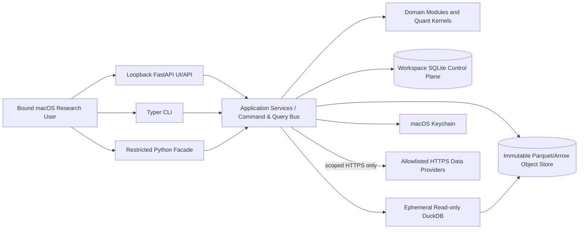
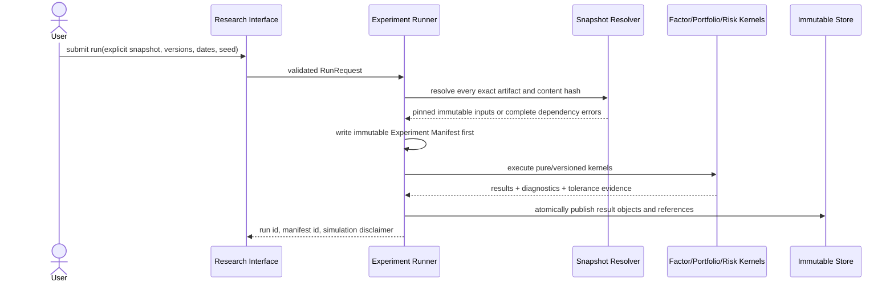
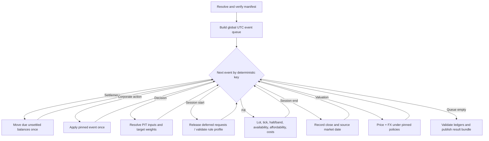

# Design Document: Multi-Market Quant Platform

## Overview

### Purpose and scope

`multi-market-quant-platform` is an independent, macOS-first, single-user quantitative research application for daily and lower-frequency A-share, Hong Kong, US equity/ETF, and open-end-fund research. It is a **research simulator**, not an execution system. The MVP has no brokerage adapter, order-routing port, live order domain type, intraday/HFT path, shorting, leverage, derivatives, cloud/distributed services, arbitrary plug-in execution, or multi-user/SaaS boundary.

The implementation is a Python modular monolith with stable internal ports. It combines:

- SQLite for transactional control-plane metadata;
- content-addressed immutable Parquet/Arrow objects for market and research data;
- ephemeral/read-only DuckDB connections for analytical scans;
- FastAPI bound only to loopback for the local API and server-rendered UI;
- Typer for the CLI and a restricted Python client facade;
- NumPy/SciPy-compatible kernels for numerical work and CVXPY only at the portfolio optimization boundary;
- macOS Keychain for provider credentials.

The architecture optimizes for correctness, inspectability, replayability, and implementability by a small team. It deliberately favors explicit versions and conservative simulation over broad feature coverage.

### Design goals

1. **Isolation and atomicity:** every mutable platform record belongs to one non-overlapping workspace and every state-changing command is authorized by the bound macOS user, serialized, staged, and committed atomically.
2. **Point-in-time correctness:** asset identity, mappings, calendars, fundamentals, universes, FX, rules, and research inputs are selected by effective interval and availability timestamp; future-visible data is excluded with evidence.
3. **Immutable evidence:** normalized observations, versions, snapshots, manifests, results, quality reports, and applied events are immutable and content-addressed.
4. **Market-semantic correctness:** A/HK/US calendars, IANA time zones, split sessions, half days, lots, ticks, price limits/bands, sell availability, and settlement are versioned inputs rather than hidden constants.
5. **Determinism:** canonical serialization, fixed ordering, Decimal boundary arithmetic, pinned algorithms/solvers, explicit tolerances, seeds, and event ordering make replay and comparison meaningful.
6. **Safe local access:** UI/CLI/Python interfaces share application services; query paths are allowlisted and read-only; provider egress is origin/path constrained; secrets fail closed.
7. **Strict MVP:** unsupported features are rejected before mutation or external effects.

### Non-goals

The MVP does not provide real or paper brokerage trading, live portfolio synchronization, intraday/minute/tick/order-book processing, derivatives, borrowing, leverage, short positions, user-written code sandboxing, remote notebooks, distributed compute/storage, a public network API, collaborative permissions, or automatic provider redistribution. Open-end-fund cumulative NAV is never synthesized when absent.

### Research findings and trade-offs

The following maintained projects inform concepts, not runtime architecture:

| Approach | Adopted concept | Rejected/limited concept and rationale |
|---|---|---|
| [Qlib data, PIT, and workflow documentation](https://qlib.readthedocs.io/en/stable/component/data.html) | data/research separation, PIT selection, run artifact tracking | no wholesale Qlib dataset/model/workflow runtime; its AI-platform breadth and storage conventions would weaken this specification's canonical identity, licensing, and multi-market rule contracts |
| [LEAN engine and reality-model documentation](https://www.quantconnect.com/docs/v2/lean-engine/getting-started) | deterministic event loop; explicit fill, fee, and slippage models | no brokerage/live-trading surface or engine embedding; live connectivity contradicts the MVP boundary and the C# engine would dominate the Python architecture |
| [Zipline-reloaded](https://github.com/stefan-jansen/zipline-reloaded) | calendar-aware event-driven backtest and data-bundle ideas | no bundle/pipeline API adoption; assumptions are not sufficient for effective-dated A/HK/US rules, fund NAV, compliance, and settlement semantics |
| [vectorbt](https://vectorbt.dev/) | vectorized pure kernels for factor and return exploration | no array-only backtest as the system of record; settlement, T+1 sell availability, corporate actions, and cross-market event order require an event ledger |
| [exchange_calendars](https://github.com/gerrymanoim/exchange_calendars) | useful reference/test oracle for sessions and breaks | not authoritative persisted data; platform calendars remain provider-sourced/versioned and explicitly support split/half-day sessions and evidence |
| [DuckDB Parquet support](https://duckdb.org/docs/current/data/parquet/overview.html) and [Arrow Parquet datasets](https://arrow.apache.org/docs/python/parquet.html) | local predicate-pushed columnar scans and explicit Arrow schemas | DuckDB is not the control-plane database and never receives unrestricted user SQL or write access |
| [CVXPY](https://www.cvxpy.org/) | declarative convex constraints and solver-status normalization | limited to approved deterministic long-only formulations; no arbitrary expression execution, unsupported non-convex objectives, or solver-specific result leakage |
| [Apple Keychain Services](https://developer.apple.com/library/mac/documentation/Security/Conceptual/cryptoservices/KeyManagementAPIs/KeyManagementAPIs.html) | OS-managed secret storage outside workspaces | credentials never fall back to workspace files or environment-file persistence |
| [FastAPI OpenAPI facilities](https://fastapi.tiangolo.com/reference/openapi/docs/) | typed local HTTP contract and generated schema | no public deployment; documentation assets are self-hosted and the server binds to loopback only |

These sources were summarized and rephrased for licensing compliance. Dependency versions are pinned by the eventual implementation lockfile and recorded in every experiment environment manifest; this design does not prescribe transient latest-version numbers.

### Key decisions

- **One process, multiple modules, one writer:** a modular monolith avoids distributed transactions. A workspace-scoped process lock plus SQLite `BEGIN IMMEDIATE` serializes mutations. CPU kernels may use worker processes only with immutable inputs; the parent alone commits outputs.
- **SQLite metadata, Parquet objects:** SQLite stores identities, effective intervals, state transitions, references, and checksums. Large tables are immutable Parquet objects. No Parquet object is edited in place.
- **Content-addressed publication:** writers create files under `staging/<operation_id>`, fsync, validate schema/count/hash, atomically rename into `objects/sha256/<prefix>/<digest>.parquet`, then commit references in SQLite. Unreferenced staged/object files are safe to garbage-collect only after recovery checks.
- **DuckDB as an ephemeral query engine:** each query receives an in-memory DuckDB connection with external access disabled, a memory/thread limit, and only snapshot-pinned object paths registered as views. The API accepts a typed query AST, never SQL text.
- **UTC instants plus local market dates:** timestamps are timezone-aware UTC instants; source-local date/time and IANA zone are retained. Date-only effective intervals use inclusive local market dates.
- **Decimal at domain boundaries, float64 in approved kernels:** persisted money, prices, rates, weights, and residuals use fixed-scale Arrow decimal/SQLite text. Statistical linear algebra converts to finite `float64`, uses deterministic ordering and one thread, then validates against stated tolerances.
- **No hidden defaults:** a missing or ambiguous version produces a typed unavailable/rejected result, never an implicit current version.

## Architecture

### System context



### Module topology

```text
src/mmqp/
  domain/             # dependency-free entities, value objects, errors, invariants
    workspace assets providers calendars market_rules fx ingestion
    corporate_actions quality universes factors portfolios backtest
    risk attribution experiments backup
  application/        # use cases, command/query DTOs, transactions, orchestration
  ports/               # Protocol/ABC contracts, versioned internal interfaces
  adapters/
    sqlite/ parquet/ duckdb/ keychain/ http_provider/ fastapi/ typer/
  kernels/             # pure Decimal/NumPy/SciPy/CVXPY-compatible algorithms
  interfaces/          # API schemas, CLI mapping, Python facade
  migrations/          # ordered, checksummed control and object-schema migrations
```

Dependency direction is `interfaces/adapters -> application -> ports/domain/kernels`. Domain modules do not import FastAPI, Typer, SQLite, DuckDB, PyArrow, provider SDKs, or CVXPY. Cross-module calls use immutable DTOs and ports. No module exposes a real-order command.

### Workspace layout and isolation

```text
<workspace>/
  workspace.toml                 # non-secret id, bound uid, format version
  control.sqlite3                # metadata and references
  control.sqlite3-wal/shm        # runtime only
  objects/sha256/ab/<digest>.parquet
  manifests/<digest>.json        # canonical JSON snapshot/run/backup manifests
  results/<run_id>/...           # content-addressed result references/exports
  staging/<operation_id>/        # same-volume temporary publication area
  locks/workspace.lock
  logs/platform.jsonl            # redacted, rotated
  backups/                       # optional backup destination; separate children only
```

`WorkspaceLocator` canonicalizes paths using resolved real paths, Unicode normalization, and case-insensitive comparison suitable for default macOS file systems. Creation/opening rejects equal, ancestor, descendant, or identifier conflicts against the user-level workspace registry at `~/Library/Application Support/MMQP/workspaces.sqlite3`. The registry contains paths and IDs only, no research data. A workspace records the bound numeric UID and a stable identity fingerprint; every mutation compares the current effective UID before acquiring the exclusive advisory lock. Read-only queries may share a process but still verify workspace identity.

A `WorkspaceUnitOfWork` executes:

1. authorize UID and acquire workspace lock;
2. begin SQLite immediate transaction and register `operation_id`/intent;
3. write and verify staged immutable objects;
4. atomically publish objects on the same volume;
5. insert immutable metadata/references and advance current pointers;
6. commit SQLite; fsync containing directories; mark operation complete.

On failure before commit, SQLite rolls back and published-but-unreferenced objects remain unreachable. Recovery removes only objects proven unreferenced by all manifests and completed backups. Multi-record commands never expose partial control-plane state.

### Control plane and data plane

SQLite uses foreign keys, strict tables where available, unique constraints for logical keys, and triggers that reject `UPDATE`/`DELETE` on immutable tables. Current-version pointers live in separate mutable tables and are changed only by application commands. Effective-date overlap is checked in application code inside the writer transaction and reinforced by indexed overlap queries.

Parquet objects use declared Arrow schemas, deterministic column order, normalized metadata, stable row ordering, UTC microsecond timestamps, and fixed Decimal precision/scale. A data object manifest records schema ID/version, row count, min/max keys, SHA-256 of canonical uncompressed Arrow IPC content, physical-file SHA-256, producer version, and parent object IDs. Logical identity uses canonical-content hash, avoiding differences caused solely by Parquet encoder metadata.

### Ingestion flow

```mermaid
sequenceDiagram
    actor User
    participant API as CLI/API
    participant App as Ingestion Application Service
    participant Compliance
    participant Adapter as Provider Adapter
    participant Normalize
    participant Quality
    participant Store as UoW + Immutable Store

    User->>API: ingest(provider, category, requested range)
    API->>App: typed command + workspace identity
    App->>Compliance: resolve immutable profile and retention permission
    App->>Store: verify estimated bytes <= available bytes
    App->>Adapter: capability/version check; scoped request
    Adapter-->>App: normalized envelope or categorized error
    App->>Normalize: resolve asset/calendar; validate all fields atomically
    Normalize->>Quality: pinned rules + provenance
    Quality-->>App: status, issues, missing-gap evidence
    App->>Store: stage object, hash/schema/count verification
    Store-->>App: atomic metadata/object publication
    App-->>API: version IDs, counts, quality summary (redacted)
```

Incremental ingestion computes expected dates from the pinned calendar, subtracts logical keys present in the selected version, and coalesces missing dates into maximal non-overlapping contiguous provider request segments. Provider responses are not retained when compliance forbids retention. Byte-identical canonical observations reuse the current version; changed observations create one parent-linked successor.

### Research flow



Workers receive read-only manifest paths and return staged outputs; they cannot write SQLite. Results become visible only after validation and parent-process commit. A snapshot containing rejected observations requires a confirmation whose key is exactly `(snapshot_id, sorted rejected_version_ids)`.

### Backtest flow and event ordering



Every event key is:

```text
(utc_instant, phase_rank, market_code, exchange_code,
 canonical_asset_id_or_empty, stable_source_id, event_sequence)
```

At the same instant, phase ranks are: `0 settlement`, `10 corporate-action position change`, `20 cash distribution`, `30 data availability`, `40 strategy decision`, `50 session start`, `60 deferred-request release`, `70 fill`, `80 session end`, `90 valuation`, `100 report checkpoint`. Strictly-later session scheduling means a decision at a session start cannot trade in that session. Independent markets interleave by actual UTC; lexical fields break true ties. Only regular sessions are executable; US pre/after-hours can exist in calendars but are never permitted by MVP rule profiles.

A fill pipeline resolves exactly one calendar and market-rule version, then applies in order: supported-capability guard, session, halt/listing, side price limit/band, positive price/tick floor, signed lot floor, sell-available lots, affordable cash, costs, fill ledger entry. Any hard rejection leaves positions and cash unchanged. A non-permitted session defers to the first later permitted session within both effective intervals; otherwise it becomes a zero fill. `SellAvailableLot` records quantity and availability date independently of cash/security settlement lots. Settlement events are idempotent by `(trade_id, settlement_leg)`.

### Trust boundaries

- FastAPI binds `127.0.0.1`/`::1`, refuses non-loopback host configuration, uses a random per-start local session token, SameSite strict cookies, origin checks and CSRF tokens for commands, and serves assets locally.
- Provider HTTP uses a dedicated client with TLS verification, redirects disabled by default, DNS/IP validation against the configured origin, normalized path containment, timeouts, response-size limits, and no ambient proxy unless explicitly allowed as part of the provider profile. Redirects are individually revalidated before any follow-up request and credentials are never forwarded cross-origin/path.
- Python users receive `ResearchClient`, not raw SQLite/DuckDB/filesystem/provider objects. Query filters are typed and allowlisted. Run submission accepts only versioned built-in definitions; no callable or source-code payload.
- Logs/errors/reports/exports pass through `RedactionGate`. If detection is indeterminate, publication is suppressed. The same gate wraps outbound optional telemetry; telemetry is off by default.

## Components and Interfaces

### Stable internal ports

Ports are Python `Protocol`s with versioned request/response dataclasses. Breaking changes create a new port version and an adapter compatibility shim; persisted artifact schema versions are independent from Python package versions.

```python
class WorkspacePort(Protocol):
    def create(self, request: CreateWorkspaceV1) -> WorkspaceRef: ...
    def open(self, workspace_id: UUID, path: Path) -> WorkspaceRef: ...
    def unit_of_work(self, operation: MutationIntent) -> WorkspaceUoW: ...

class AssetRegistryPort(Protocol):
    def register_asset(self, command: RegisterAssetV1) -> AssetVersionRef: ...
    def map_provider_asset(self, command: MapProviderAssetV1) -> MappingRef: ...
    def resolve_provider_asset(self, provider: str, code: str, on: date) -> Resolution: ...
    def asset_as_of(self, asset_id: UUID, on: date) -> AssetMasterVersion: ...

class ProviderAdapterV1(Protocol):
    def capabilities(self) -> AdapterCapabilitiesV1: ...
    def fetch(self, request: ProviderRequestV1, credential: SecretHandle) -> ProviderEnvelopeV1: ...

class CalendarPort(Protocol):
    def interpret(self, market: Market, exchange: str, timestamp: AwareDatetime) -> MarketInstant: ...
    def sessions(self, calendar_version: str, market_date: date) -> tuple[Session, ...]: ...
    def next_permitted_session(self, request: SessionSearch) -> Session | Unavailable: ...

class SnapshotPort(Protocol):
    def create(self, exact_versions: Sequence[ArtifactRef]) -> DataSnapshot: ...
    def resolve(self, snapshot_id: str) -> VerifiedSnapshot: ...

class ResearchQueryPort(Protocol):
    def query(self, snapshot_id: str, query: TypedQueryV1) -> QueryPageV1: ...

class ExperimentPort(Protocol):
    def submit(self, request: ResearchRunRequestV1) -> ResearchRunRef: ...
    def replay(self, manifest_id: str) -> ResearchRunRef: ...
    def compare(self, left: str, right: str) -> RunComparison: ...
```

Other domain ports are `CompliancePort`, `CredentialPort`, `FXPort`, `CorporateActionPort`, `QualityPort`, `UniversePort`, `FactorPort`, `PortfolioPort`, `BacktestPort`, `RiskPort`, `AttributionPort`, `BackupPort`, `ClockPort`, and `ContentStorePort`. All mutation responses include `operation_id`; all unavailable/rejected responses use the common error model.

### Domain components

| Component | Responsibilities | Explicit exclusions |
|---|---|---|
| Workspace Service | registry conflict checks, UID binding, lock/UoW, atomic recovery | cross-workspace queries or shared object paths |
| Asset Registry | canonical IDs, effective Asset Master and provider mappings, historical lookup | ticker-as-identity assumptions |
| Provider/Compliance | capability discovery, contract compatibility, profile versioning, request limits/errors/provenance | provider-specific objects beyond adapter boundary |
| Calendar Service | timezone conversion, DST, trading/valuation dates, split/half-day sessions, alignment | naive timestamp interpretation |
| Market Rule Service | effective lot/tick/limit/session/sell/settlement rules | hard-coded exchange behavior in backtest |
| Ingestion Service | request segmentation, validation, normalization, version publication | partial observation persistence |
| Corporate Action Service | immutable events, adjustment series, idempotent holding actions | rewriting raw prices or inferred fund cumulative NAV |
| FX Service | direct/inverse versioned rates, policy lookup, conversions/effects | hidden triangulation in MVP; cross rates require an explicitly persisted derived rate |
| Quality Service | pinned rules, issue evidence, status, gap reason precedence | silently dropping expected dates |
| Universe Service | effective membership, lifecycle/liquidity PIT filters, bias evidence | present-day constituent reconstruction |
| Factor Service | validated transformation DAG/list, PIT windows, winsorize/z-score/neutralize | arbitrary Python expressions |
| Evaluation Service | aligned IC, ranks, quantiles, future returns, autocorrelation, turnover | using pre-decision endpoints as future returns |
| Portfolio Service | long-only targets, constraints, deterministic optimization/diagnostics | negative weights, leverage, borrowing |
| Backtest Engine | global event queue, ledgers, fills, costs, corporate actions, valuation | orders, broker connections, intraday strategies |
| Risk Service | aligned returns, volatility/drawdown/TE/beta, covariance contributions, concentration | inventing missing inputs |
| Attribution Service | Modified Dietz-like period return, contribution, Brinson-Fachler, FX, linking | forcing residuals by arbitrary allocation |
| Experiment Runner | manifest-before-result, content verification, replay, comparison | mutable runs/results |
| Research Interface | identical query/run capabilities across Web/CLI/Python | raw DB/SQL/filesystem/provider access |
| Security Service | Keychain, endpoint policy, redaction, optional egress consent | plaintext secret backup/logging |
| Backup/Migration | verified manifests, atomic restore, pre-migration backup/rollback | in-place unverified migration |

### Provider adapter and compliance contract

`AdapterCapabilitiesV1` contains adapter-contract version, credential-reference types (never values), supported markets/assets/categories, inclusive date ranges, frequencies, integer request limit and period, and tri-state normalized-response/provenance/categorized-error capabilities (`supported`, `unsupported`, `unknown`). Missing declarations become `unknown`; unsupported contract versions remain disabled.

`ComplianceProfileVersion` contains provider, account type, non-empty permitted purposes, complete category-to-retention and category-to-export maps, aware confirmation timestamp, immutable ID, and predecessor ID. Before each request, the service binds one profile valid at request time. A provider envelope contains provider name/code, exact request parameters, retrieval time, source version/correlation ID, raw field values held only in memory until retention authorization, normalized observations, and categorized errors (`timeout`, `throttled`, `unavailable`, `authentication`, `invalid_response`, `policy_blocked`). The hard response timeout is 30 seconds.

### Calendar and market-rule contract

Calendar versions are effective-dated headers plus day/session rows. Day kind is exactly `closed | full | half`; zero sessions are legal only for closed days. Sessions use local wall times, explicit `regular | non_regular` type, and ordered non-overlapping intervals. Time conversion uses Python `zoneinfo` IANA data pinned in the dependency environment. Calendar resolution must yield exactly one version.

Market-rule profiles key on market, exchange, asset type and effective date. Rules are declarative:

- integer `trading_lot` in `[1, 1_000_000_000]`;
- positive Decimal `tick_size <= 1_000_000_000`;
- `price_limit_rule` (`none`, static percentage/reference rule, provider-band-required);
- `sell_availability_rule` (`same_market_date`, `next_open_market_date`);
- `settlement_rule` as N applicable open dates for security and cash legs;
- 1–8 permitted session types, constrained by MVP to regular execution.

Rule evaluation outputs both value and source version. Lot and tick flooring use Decimal/integer arithmetic, never binary float.

### Factor definitions and kernels

A `TransformationSpecificationVersion` is an allowlist of names, arity, parameter schema/bounds, minimum observations, output-unit rule, and legal predecessor types. MVP built-ins are `identity`, `lag`, `simple_return`, `log_return`, `rolling_mean`, `rolling_std`, `ratio`, `difference`, `rank`, `winsorize`, `zscore`, and `neutralize_ols`. A `FactorDefinition` is a serializable ordered transformation plan, not code. Validation resolves each input against the pinned snapshot schema and checks the complete chain before persistence.

PIT window selection uses `(provider_available_at <= decision_timestamp)` and exact snapshot/universe/calendar versions. Cross-sectional operations sort by `(factor_value, canonical_asset_id)` where applicable. Neutralization builds a deterministic design matrix ordered by exposure name and asset ID, with explicit reference-category removal; it uses an approved least-squares kernel and returns undefined on rank/finite-input failure rather than silently regularizing.

### Portfolio construction

MVP supports deterministic score-proportional construction and an approved long-only optimization form:

```text
maximize     signal^T w - lambda_turnover * ||w - current||_1
subject to   sum(w) + cash = 1
             0 <= w_i <= asset_cap_i <= 1
             0 <= cash <= 1
             group lower/upper bounds
             one-way turnover <= T
             count(w_i > 1e-12) <= H
```

CVXPY constructs the continuous problem. If a maximum holding count is active, deterministic candidate-selection/MIP support must prove feasibility; the approved solver and exact solver/version/settings are pinned. Unsupported objective classes are rejected at definition validation. No result is accepted unless an independent Decimal validator confirms all constraints within `1e-12`.

Tie-breaking is exact at the application semantic level: first solve the primary objective; constrain it to within `1e-12` of optimum; then, in ascending Canonical Asset ID followed by cash, sequentially maximize and fix each coordinate within `1e-12`. The final independently validated vector is the lexicographically greatest admissible vector under the tolerance. Solver warm starts are disabled and threads/seeds/options are pinned.

For infeasibility, an exact memoized branch-and-bound over constraint subsets uses the same feasibility oracle, monotonic pruning, and ascending constraint-ID traversal to find the first minimum-cardinality infeasible subset. This can be expensive at the 256-constraint bound, but it is deterministic and complete; progress is observable and no partial portfolio is published. Solver-provided IIS output may seed pruning but is never accepted as proof of minimum cardinality.

### Read-only analytics and query contract

`TypedQueryV1` contains one dataset enum, 0–20 allowlisted predicates, typed values, and no projection expression, join, function, path, or SQL. The snapshot resolver maps the dataset to exact object paths. DuckDB is configured read-only/in-memory with extension auto-install/loading and external access disabled. The query compiler emits parameterized SQL over registered views, stable null-first ordering by canonical asset ID/date-or-timestamp/version, and `LIMIT 10001`; the 10001st row only determines `additional_results`.

### Local API contract

All endpoints are under `/api/v1`; mutation endpoints require the local session/CSRF token and return an operation ID. Representative contracts:

| Method/path | Request | Response |
|---|---|---|
| `POST /workspaces` | path, display name | workspace ref or complete conflicts |
| `POST /providers/{id}/enable` | adapter version, compliance version | capabilities shown/accepted state |
| `POST /ingestions` | provider/category/date range/snapshot base | ingestion operation/result |
| `POST /snapshots` | exact artifact versions | immutable snapshot ref |
| `POST /factor-definitions` | versioned transformation plan | definition ref/violations |
| `POST /portfolio-definitions` | objective, constraints, versions | definition ref/violations |
| `POST /runs` | explicit run request | run + manifest ref |
| `POST /runs/{id}/replay` | no override fields | replay run ref |
| `GET /runs/compare?left=&right=` | two run IDs | manifest and numeric differences |
| `POST /query` | snapshot + typed query | metadata + up to 10,000 rows |
| `POST /backups` | destination, selected artifacts, credential option | verified backup ref |
| `POST /restores/verify` | backup path | compatibility/verification report only |
| `POST /restores` | verified backup ID | atomic restore result |
| `GET /status` | none | named platform/adapter/schema/storage/ingestion fields |

Every backtest/portfolio response and UI page carries `result_kind: research_simulation`, a non-advice/non-order disclaimer, manifest/snapshot IDs, provenance, quality status, currency/date semantics, and bias warnings.

### CLI and Python contracts

Typer commands are stable wrappers around the same DTOs:

```text
mmqp workspace create|open|status
mmqp provider inspect|configure|enable|delete
mmqp credential set|delete                 # value via hidden prompt/stdin, never argument echo
mmqp ingest plan|run
mmqp snapshot create|show
mmqp factor define|run|evaluate
mmqp portfolio define|construct
mmqp backtest run
mmqp risk run
mmqp attribution run
mmqp run show|replay|compare
mmqp query <dataset> --snapshot ... --filter field:op:value
mmqp backup create|verify
mmqp restore verify|apply
mmqp migrate plan|apply
```

Commands default to JSON output for automation with an optional redacted table view. Exit codes are `0 success`, `2 validation/rejection`, `3 unavailable dependency`, `4 policy/security block`, `5 conflict`, `6 internal/recovery required`.

The local Python facade exposes typed equivalents such as `client.query(...)`, `client.submit_run(...)`, `client.replay(...)`, and `client.compare(...)`. It exposes no credential values, provider request primitive, SQL connection, filesystem handle, or generic mutation method. Web, CLI, and Python conformance tests run the same contract vectors.

### Deterministic numeric policy

1. Canonical persisted numerics use declared Decimal precision/scale; JSON encodes them as canonical strings, never JSON floats.
2. Input is rejected if non-finite, outside required range, or would require silent precision loss. Rounding mode for required quantization is `ROUND_HALF_EVEN`; lot/tick rules explicitly use floor toward zero as specified.
3. Collections are sorted by stable IDs before reduction. Decimal reductions are sequential in that order. Float kernels use `float64`, finite checks, pairwise/stable summation where available, fixed single-thread BLAS/OpenMP environment, and no GPU.
4. Means, sample/population variances, IC formulas, ranks, quantile assignment, turnover, returns, risk, and attribution follow the exact equations in requirements. Ties use average rank except quantile allocation, which uses Canonical Asset ID as secondary order.
5. Eigenvalue PSD checks use a symmetric `float64` matrix after exact shape/finite/symmetry checks; the tolerance is scaled exactly as specified. Contributions are independently reconciled.
6. Run manifests pin Python/package versions, tzdata, Arrow/Parquet schema, kernel version, solver/version/settings, CPU architecture, thread counts, random seed, and code content ID. Cross-environment replay outside a compatible numeric-environment class is reported as non-comparable rather than silently certified.
7. Discrete outputs must match exactly. Numeric replay uses the requirement-specific tolerance. All tolerance decisions store actual residual, threshold, and pass/fail.

## Data Models

### Identifier and interval conventions

- UUIDv7 is used for operational IDs; content IDs use lowercase `sha256:<64-hex>`.
- Inclusive date intervals satisfy `effective_start <= effective_end`; open-ended source data is normalized to an explicit maximum supported date, never SQL `NULL` ambiguity.
- Aware timestamps are UTC in storage plus original offset/zone when semantically relevant.
- Immutable entities include `version_id`, `created_at`, `content_id`, optional `predecessor_version_id`, and schema version.
- `RawValue` stores provider bytes/value representation only when compliance permits retention and is never overwritten.

### Core SQLite aggregates

| Aggregate/table | Essential fields and invariants |
|---|---|
| `workspace` | workspace_id unique, canonical_path unique/non-overlapping via registry, bound_uid, created_at, format_version |
| `operation` | operation_id, command type, UID, status, intent hash, timestamps; one terminal state |
| `asset_identity` | canonical_asset_id, immutable identity tuple market/exchange/asset_type/local_code; unique tuple |
| `asset_master_version` | asset ID, name, lifecycle, exchange, trading currency, inclusive interval, predecessor; no overlap per asset |
| `provider_asset_mapping` | provider, code, asset ID, inclusive interval, version; lookup may intentionally surface overlaps as ambiguity |
| `adapter_registration` | provider, adapter package/content ID, contract version, capabilities JSON, enabled state |
| `compliance_profile_version` | provider/account/purposes/category permissions/aware confirmation/version/predecessor; immutable |
| `calendar_version/day/session` | market/exchange/zone/effective interval/version; date kind; 0–8 ordered, non-overlapping local sessions |
| `valuation_calendar_version/day` | fund market/zone/effective interval/version and expected valuation dates |
| `market_rule_profile_version` | key/effective interval, lot, tick, price-limit, sell/settlement rules, session types |
| `data_version` | dataset/logical key/content object ID/predecessor/current flag via separate pointer/provenance/compliance/quality |
| `fundamental_revision` | asset/metric/reporting period/value/unit/currency/announcement/available_at/provider/revision/predecessor |
| `corporate_action_version` | event ID/asset/type/dates/terms/provenance/version/conflict key |
| `adjustment_factor_version` | asset/date/factor/source/anchor/version/provenance |
| `fx_rate_version` | source/target/date/rate/provider/retrieved/provenance/direct-source ID if inverse |
| `quality_issue/report` | rule/version/severity/evidence fields; report scope/counts/generated_at/object ID |
| `universe/membership_version` | universe version, asset, interval, source/version; overlap evidence retained |
| `definition_version` | typed factor/portfolio/strategy/cost/risk definition canonical JSON and content ID |
| `snapshot` | content-derived ID and canonical ordered artifact-reference manifest |
| `experiment_manifest` | all required pinned IDs/parameters/seed/code/environment; persisted before result |
| `research_run/result` | run ID, manifest ID, state; immutable result object refs and simulation marking |
| `confirmation` | snapshot ID + exact sorted rejected version set hash + UID + timestamp |
| `backup` | backup ID, manifest ID, compatibility, verification/restorable state |

SQLite current-pointer tables can change atomically but immutable rows cannot. References use foreign keys and deferred checks inside a UoW.

### Canonical Arrow/Parquet schemas

```text
DailyBarV1
  canonical_asset_id: fixed_utf8 UUID
  trading_date: date32
  open, high, low, close: decimal128(28, 8)
  volume, turnover: decimal128(38, 8)
  trading_currency: fixed_utf8(3)
  provider_available_at, retrieved_at: timestamp[us, UTC]
  provider, provider_code, provenance_id, data_version_id: utf8
  quality_status: dictionary(valid|warning|rejected)

FundNavV1
  canonical_asset_id, valuation_date
  unit_nav: decimal128(28, 8)
  cumulative_nav: decimal128(28, 8) nullable   # null means explicitly unavailable
  pricing_currency, provider timestamps/provenance/version/quality

FundamentalFactV1
  canonical_asset_id, metric_name, value: decimal256(50, 16)
  unit, currency nullable, reporting_period_start/end
  announcement_at, provider_available_at: timestamp[us, UTC]
  provider, revision_version, predecessor_revision, provenance, quality

FXRateV1
  source_currency, target_currency, rate_date
  rate: decimal256(50, 24)
  provider, provider_pair, retrieved_at, direct_source_version nullable
  provenance_id, data_version_id

FactorValueV1
  canonical_asset_id, factor_id, factor_definition_version
  factor_date, decision_at, value: float64 nullable
  status: numeric|missing|undefined
  reason, required_count, available_count, snapshot_id, universe_version, quality
```

Additional schemas are `CorporateActionV1`, `AdjustmentFactorV1`, `UniverseMembershipV1`, `TargetWeightV1`, `SimulatedTradeV1`, `PositionLotV1`, `CashLedgerEntryV1`, `ValuationV1`, `RiskMetricV1`, `AttributionComponentV1`, and `QualityIssueV1`. Each schema includes exact source/version/provenance keys needed to reproduce the result.

### Snapshot and manifest models

`DataSnapshotManifestV1` is canonical JSON:

```json
{
  "schema_version": 1,
  "artifacts": [
    {"kind": "daily_bar", "version_id": "...", "content_id": "sha256:..."}
  ],
  "quality_report_versions": ["..."],
  "created_at": "...Z"
}
```

Artifacts are sorted by `(kind, logical_scope, version_id, content_id)`. The snapshot ID is derived from canonical ordered content excluding the non-semantic creation timestamp.

`ExperimentManifestV1` includes run ID, snapshot, universe, inclusive dates, base currency, FX policy, provider/calendar/valuation-calendar/market-rule/FX/corporate-action/adjustment/quality/factor/portfolio/strategy/cost/risk versions, parameters, seed, code ID, environment ID, numeric policy version, and expected output schema IDs. Missing or ambiguous references prevent manifest creation. The immutable manifest is committed before the runner transitions from `created` to `running`.

### Ledger models

- `PositionLot`: asset, acquisition trade/event, quantity, cost basis in local/base currency, sell-available date, security-settlement date, settled flag.
- `CashLedgerEntry`: currency, amount, kind (`settled`, `unsettled_receivable`, `unsettled_payable` represented with non-negative balance buckets plus direction), source ID, availability/settlement date.
- `SimulatedTrade`: requested/signed valid-lot/filled quantity, valid-tick execution price, currencies/FX version, gross, each non-negative cost and total, timestamps/source date, sell/settlement dates, zero-fill/defer reason, rule versions.
- `AppliedCorporateAction`: `(backtest_id, position_scope, event_id)` unique, before/after quantity/cost/cash evidence.

Ledger mutation functions return a complete proposed next state plus balanced entries. The engine verifies non-negative settled cash, receivables, and asset quantities after each event before committing the in-memory event; failure aborts the complete backtest publication.

### Query/result models

`QueryPageV1` includes snapshot ID, canonical query parameters, matching count, returned count, applied-filter count, `additional_results`, ordered records, provenance/quality/currency/date semantics, and bias warnings. A separate count query and limited row query run against the same resolved immutable paths, so no mutable-read race exists.

`RunComparison` contains all manifest-field differences and aligned result differences. Numeric difference records hold left/right, absolute difference, relative difference (`0` for two zeros, unavailable for exactly one zero), tolerance, and equivalence. Non-finite values are never classified as finite equivalents.

### Backup model

`BackupManifestV1` contains platform/schema versions, compatible restore range, and for every included dataset: identity, schema, non-negative record count, canonical content checksum, physical checksum, immutable versions, and referenced objects. Credentials are excluded by default. If explicitly included, each secret payload is authenticated-encrypted using a fresh data key protected by a user-supplied backup secret/Keychain wrapping key; plaintext never enters the manifest. A backup is `restorable` only after independent record-count, checksum, reference-closure, and encryption-authentication verification.

## Correctness Properties

*A property is a characteristic or behavior that should hold true across all valid executions of a system—essentially, a formal statement about what the system should do. Properties serve as the bridge between human-readable specifications and machine-verifiable correctness guarantees.*

The feature is suitable for property-based testing because its core contains pure interval selection, validation, canonicalization, transformation, ranking, optimization validation, event-ledger, risk, and attribution logic over large input spaces. External macOS, filesystem, SQLite, HTTP, UI, and encryption behavior remains integration/security tested. The properties below reflect the prework consolidation: one property captures each distinct invariant without multiplying equivalent rejection or field-validation statements.

### Property 1: Authorized mutation is atomic

For any workspace state, mutation command, injected domain failure, and requesting identity, the command either commits its complete valid state transition for the bound identity or leaves every workspace record unchanged; a mismatched identity or unsupported MVP capability always takes the unchanged branch with complete diagnostics and zero market transaction.

**Validates: Requirements 1.3, 1.4, 1.7**

### Property 2: Workspace identities and paths never overlap

For any set of existing workspace identifiers and canonical storage paths, an accepted new workspace has a distinct identifier and a path that is neither equal to, contains, nor is contained by any existing path; every conflict is rejected without changing the set.

**Validates: Requirements 1.8, 1.10**

### Property 3: Canonical asset identity is idempotent and discriminating

For any valid asset identity tuple `(Market, exchange, asset type, exchange-local code)`, repeated registration returns one stable Canonical Asset ID, while changing any tuple component yields a different ID, and the accepted asset has exactly one supported type.

**Validates: Requirements 2.1, 2.2, 2.3, 2.4**

### Property 4: Asset master history is valid and point-selectable

For any generated sequence of valid effective-dated asset changes, each accepted change appends exactly one immutable version, as-of lookup returns the sole interval-containing version including delisted/terminated history, and any invalid record reports all violations without changing IDs or history.

**Validates: Requirements 2.5, 2.6, 2.7, 2.13, 2.14**

### Property 5: Provider asset mapping has total three-way resolution

For any provider/code/date and generated valid mapping intervals, resolution returns the sole Canonical Asset ID when exactly one interval contains the date, an unresolved result echoing the lookup when none does, or an ambiguity containing every matching ID/interval when multiple do; invalid mapping commands leave all mappings unchanged.

**Validates: Requirements 2.8, 2.9, 2.10, 2.11, 2.12**

### Property 6: Adapter and compliance descriptors normalize completely

For any adapter descriptor, request-limit declaration, and compliance profile, every declared value is normalized under one contract version, omitted capabilities become `unknown`, limits are accepted exactly in their bounds, and a valid compliance change appends one complete immutable version without altering predecessors.

**Validates: Requirements 3.1, 3.2, 3.4, 3.5, 3.8, 3.10**

### Property 7: Provider policy gates every side effect

For any provider request, adapter contract, request time, compliance history, response, and requested retention/export action, a request is sent only through a compatible enabled adapter with exactly one valid bound profile; prohibited retention persists no response data, prohibited export emits zero bytes, invalid profiles or versions preserve prior state, and every persisted observation has exactly one provenance/profile pair.

**Validates: Requirements 3.6, 3.7, 3.9, 3.11, 3.12, 3.13, 3.14**

### Property 8: Calendar interpretation is unique and timezone-correct

For any valid calendar/version set and aware timestamp, date interpretation first converts through the market's required IANA zone—including the New York offset active at that instant—and succeeds only with exactly one applicable version; accepted day/session structures satisfy type, count, order, non-overlap, and interval invariants, while naive timestamps or invalid/ambiguous structures produce no date or mutation.

**Validates: Requirements 4.1, 4.2, 4.3, 4.4, 4.5, 4.6, 4.7, 4.8, 4.9, 4.10, 4.11, 4.12**

### Property 9: Cross-market alignment preserves source semantics and enforces availability

For any alignment date, decision timestamp, and candidate observations, every retained observation preserves its source market date and receives the requested alignment date if and only if its Provider Available At is no later than the decision and requested filters pass; later observations are excluded with evidence and never modified.

**Validates: Requirements 4.13, 4.14, 4.15**

### Property 10: Market-rule lookup, lot flooring, and tick flooring are exact

For any trade and rule-profile set, evaluation proceeds only with exactly one complete matching profile; signed quantity is floored to the greatest lot multiple not exceeding its magnitude, positive price is floored to the greatest tick multiple not exceeding it, and invalid profiles, no/multiple matches, sub-lot quantities, or non-positive prices yield zero fill and unchanged ledgers.

**Validates: Requirements 5.1, 5.2, 5.3, 5.4, 5.7, 5.8, 5.9, 5.10**

### Property 11: Non-tradable requests never mutate ledgers

For any requested trade, selected profile, market state, and session sequence, a blocking price limit/band, suspended/delisted/unknown halt state, or unavailable quantity yields zero fill and unchanged positions/cash; an out-of-session request is deferred to the first subsequent permitted regular session or zero-filled if none exists, and US pre/after-hours are never executable.

**Validates: Requirements 5.11, 5.12, 5.13, 5.14, 5.15, 5.16, 5.17**

### Property 12: Sell availability and settlement are independent idempotent clocks

For any filled purchase and applicable calendars/rules, A-share sell availability is the first later open date, same-day HK/US availability is used only when configured, exactly one sell-available and one independently computed settlement date are recorded, balances remain unsettled before settlement, and any number of duplicate due events transfers each settlement leg exactly once.

**Validates: Requirements 5.5, 5.6, 5.18, 5.19, 5.20**

### Property 13: FX direct/inverse conversion round-trips

For any valid positive Decimal value and direct FX rate, the immutable inverse equals Decimal `1/rate` with the direct version as source; non-base conversion records exactly one selected rate and complete provenance, base-currency conversion uses identity without a rate, and converting back with that exact inverse reproduces the source within relative error `1e-12`.

**Validates: Requirements 6.2, 6.3, 6.4, 6.5, 6.6, 6.11, 6.13**

### Property 14: FX policy selection is deterministic and bounded

For any valid definition/report and rate history, exactly one ISO base currency and one policy convention are required; exact-date selects only the valuation date, fallback selects the most recent rate among the five applicable FX business dates ending on it, and no eligible rate returns the complete examined-set unavailable result without persisting a conversion.

**Validates: Requirements 6.1, 6.7, 6.8, 6.9, 6.10**

### Property 15: Market observations validate and publish atomically

For any generated Daily Bar, Fund NAV, or Fundamental Fact and applicable calendars, acceptance occurs only when exactly one calendar applies and every required numeric, relational, field, timestamp, currency, and unit rule holds; otherwise every violation is reported, no partial observation is persisted, and at most one current bar/NAV exists per logical key.

**Validates: Requirements 7.1, 7.2, 7.3, 7.4, 7.5, 7.6, 7.7, 7.8, 7.12, 7.13, 7.14**

### Property 16: Fundamental revisions are immutable and selected point-in-time

For any revision history and decision timestamp, each accepted revision links only to its immediate predecessor, revisions after the decision are excluded with evidence, and selection among visible revisions is the latest Provider Available At then the highest successor position at a tie.

**Validates: Requirements 7.9, 7.10, 7.11**

### Property 17: Increment planning and observation versioning are canonical

For any expected-date set and selected data version, incremental requests equal the maximal non-overlapping contiguous runs of absent expected dates; ingesting a canonically byte-equal logical observation reuses its version, while changing any canonical field appends exactly one immediate successor.

**Validates: Requirements 7.15, 7.16, 7.17**

### Property 18: Adjustment is explicit, complete, and non-destructive

For any raw price series, corporate-action versions, adjustment mode, and factor series, raw bytes remain unchanged; unadjusted output equals raw, adjusted output uses exactly one valid pinned factor per date and records mode/source/version/anchor/provenance, while missing/invalid factors, mode cardinality errors, or active action conflicts publish no affected series. Fund cumulative NAV equals provider-supplied data or is explicitly unavailable, never derived.

**Validates: Requirements 8.1, 8.2, 8.3, 8.4, 8.5, 8.6, 8.7, 8.8, 8.12, 8.13, 8.14**

### Property 19: Corporate actions apply exactly once

For any held position, pinned split-like or cash-distribution event, withholding assumption, and number of duplicate deliveries, position/cost terms or payment-date cash are applied exactly once and every later delivery leaves quantity, cost basis, and cash unchanged.

**Validates: Requirements 8.9, 8.10, 8.11**

### Property 20: Quality status and gap reason are deterministic maxima

For any pinned applicable quality rules and observations, exactly those rules execute; each failure yields one complete reproducible issue, final status is the maximum severity, reports reconcile issue/status counts, expected dates are retained, and overlapping missing conditions select one reason under the declared precedence.

**Validates: Requirements 9.1, 9.2, 9.3, 9.4, 9.5, 9.6, 9.7, 9.8, 9.9, 9.10, 9.11**

### Property 21: Rejected-data confirmation is exact

For any snapshot and rejected observation-version set, run creation succeeds past the quality gate only when confirmation is bound to that exact snapshot ID and complete immutable set; absent, subset, superset, or other-snapshot confirmation leaves all runs unchanged.

**Validates: Requirements 9.12, 9.13**

### Property 22: Point-in-time universes exclude ambiguity and future data

For any universe version, date, decision timestamp, membership/lifecycle/liquidity histories, and missing dependencies, included assets are exactly those with one date-effective membership and PIT-valid filters; zero/overlap/future/missing inputs exclude the asset with deterministic evidence, incomplete-date warnings are maximal contiguous ranges, and all cross-section counts reconcile without changing membership data.

**Validates: Requirements 10.1, 10.2, 10.3, 10.4, 10.5, 10.6, 10.7, 10.8, 10.9, 10.10, 10.11**

### Property 23: Factor definitions and dependency resolution are all-or-nothing

For any transformation specification, snapshot schema, factor definition, decision time, and dependency set, the definition is accepted only when all bounds, fields, parameters, predecessor types, and ordered transformations validate; calculation uses only visible pinned inputs/exposures, and any unavailable/ambiguous dependency or insufficient observation count yields complete missing/undefined results without numeric or definition mutation.

**Validates: Requirements 11.1, 11.2, 11.3, 11.4, 11.5, 11.6, 11.7, 11.9, 11.12, 11.13**

### Property 24: Winsorization equals indexed clamping

For any non-empty sorted cross-section and quantiles `0 <= q_lower < q_upper <= 1`, every winsorized value equals the requirement's one-based indexed lower/upper clamp.

**Validates: Requirements 11.8**

### Property 25: Z-score standardization follows the population formula

For any finite cross-section with at least two values and positive population dispersion, every z-score is within absolute error `1e-12` of `(x-μ)/σ`; fewer values or zero dispersion produces one undefined cross-section and no numeric standardized values.

**Validates: Requirements 11.10, 11.11**

### Property 26: Repeated factor evaluation is reproducible

For any identical factor definition, snapshot, universe, factor date, and decision timestamp, repeated evaluation reproduces all missing/undefined statuses exactly and every numeric value within `1e-12 * max(1, abs(original))`.

**Validates: Requirements 11.14**

### Property 27: Correlation kernels use exact aligned sets and tie ranks

For any aligned finite factor/return pairs or consecutive shared factors, Pearson uses exactly the aligned set, Spearman and rank autocorrelation use average occupied ranks, and too-few or zero-dispersion inputs return undefined with counts/reasons and no numeric persistence.

**Validates: Requirements 12.1, 12.2, 12.3, 12.8, 12.9**

### Property 28: Quantile allocation and return are deterministic

For any cross-section with valid `Q`, assets sorted by factor then Canonical Asset ID receive the specified rank-derived groups, and each valid group's return equals its weighted formula (unit weights for equal weight); invalid `Q`, insufficient distinct values, bad weights, or missing returns yields complete typed failure and no numeric group result.

**Validates: Requirements 12.4, 12.5, 12.6, 12.7**

### Property 29: Future returns and turnover use the specified endpoints and union

For any decision, holding period, endpoint stream, and consecutive portfolio pair, future return uses the earliest `h+1` valid endpoints strictly after decision, invalid endpoints yield explicit missing evidence, and one-way turnover equals half the absolute weight change over the asset union with absent weights zero; a completed report reconciles its counts and derived series.

**Validates: Requirements 12.10, 12.11, 12.12, 12.13**

### Property 30: Every published target portfolio is independently feasible

For any accepted Portfolio Definition, signals, current weights, classifications, and constraints, published asset/cash weights are in `[0,1]`, sum to one within `1e-12`, obey asset/group/count/turnover limits, use the specified union turnover formula, and record all input versions/objective/status/residuals; invalid or unsupported definitions/requests publish nothing and preserve prior targets.

**Validates: Requirements 13.1, 13.2, 13.3, 13.4, 13.5, 13.6, 13.7, 13.8, 13.10, 13.11, 13.13**

### Property 31: Portfolio tie-breaking and repetition are deterministic

For any feasible target set whose primary objective values differ by no more than `1e-12`, construction selects the lexicographically greatest vector in ascending Canonical Asset ID then cash order; identical complete inputs reproduce selected assets exactly and weights within absolute `1e-12`.

**Validates: Requirements 13.9, 13.14**

### Property 32: Infeasibility diagnostics are minimal and atomic

For any infeasible finite constraint set, the result contains the ascending-ID selected minimum-cardinality infeasible subset, no proper smaller-cardinality subset is infeasible, no partial target is published, and prior targets remain unchanged.

**Validates: Requirements 13.12**

### Property 33: Backtest decisions are PIT-valid and schedule strictly later regular sessions

For any strategy inputs, pinned manifest, market calendars, and decision timestamps, the engine accepts at most one decision per asset/market date, uses only visible inputs, schedules resulting requests to the earliest permitted regular session strictly later in local market semantics, and rejects future-visible, missing/ambiguous-pin, higher-frequency, or unsupported strategy inputs before relevant trade/ledger mutation.

**Validates: Requirements 14.1, 14.2, 14.3, 14.4, 14.5, 14.6, 14.18**

### Property 34: Backtest event processing preserves ledger invariants

For any valid global event sequence, after every event settled cash, unsettled receivables, and asset quantities remain non-negative; disallowed halt/limit states and excess sells zero-fill without mutation, while every fill and completed run records all required fields/output families under exactly one manifest.

**Validates: Requirements 14.7, 14.8, 14.10, 14.11, 14.17**

### Property 35: Costs reconcile and purchases use the maximal affordable lot

For any valid requested purchase, cash balance, lot, execution price, and pinned cost model, each cost is non-negative and total equals component sum within `1e-12`; filled quantity is the greatest non-negative lot multiple whose gross plus quantity-dependent total cost is affordable, or zero with unchanged state when none is affordable.

**Validates: Requirements 14.9, 14.12, 14.13**

### Property 36: Valuation policy is bounded and source-dated

For any held assets, valuation date, market calendars, prices, and FX history, the selected policy is exactly unavailable or latest valid close within five preceding open dates; absence makes dependent values unavailable without ledger mutation, while every successful asynchronous-market value records the selected source market and FX dates.

**Validates: Requirements 14.14, 14.15, 14.16**

### Property 37: Aligned-sample risk metrics equal their reference formulas

For any timestamped portfolio/benchmark series, metric alignment contains exactly common non-missing endpoint pairs; valid samples produce the specified annualized sample volatility, prefix-peak maximum drawdown, tracking error, and beta, while too-few or zero benchmark variance yields a typed undefined beta and no numeric value.

**Validates: Requirements 15.1, 15.2, 15.3, 15.4, 15.5, 15.6**

### Property 38: Covariance acceptance and contributions reconcile

For any generated matrix and holding map, covariance-dependent metrics are computed only for a finite square holding-aligned matrix symmetric within tolerance and PSD under the scaled eigenvalue threshold with positive portfolio variance; accepted marginal/component contributions follow the formulas and component variance sums to portfolio variance within the stated tolerance, while rejected matrices leave independent metrics intact.

**Validates: Requirements 15.7, 15.8, 15.9, 15.10**

### Property 39: Concentration and metric dependency are explicit

For any positive asset market values and classifications, weights and single/top-five/group concentrations equal their reference aggregates; any missing input makes exactly dependent metrics unavailable while preserving independent metrics, and the report contains every required version, sample, convention, policy, quality, and reason field.

**Validates: Requirements 15.11, 15.12, 15.13**

### Property 40: Period return and basic contributions reconcile

For any valid beginning/ending values, timed flows, asset/cash returns, and transaction costs, periodic return, asset/cash contributions, and cost drag equal their specified formulas, active return equals portfolio minus benchmark, and residual is within `1e-10`; zero denominator or missing inputs makes the return and dependents unavailable.

**Validates: Requirements 16.1, 16.2, 16.3, 16.4, 16.5, 16.6, 16.7**

### Property 41: Brinson-Fachler effects reconcile to active return

For any aligned valid portfolio/benchmark group weights and returns, each allocation, selection, and interaction effect equals the stated Brinson-Fachler formula and their sum reconciles to active return within absolute residual `1e-10`.

**Validates: Requirements 16.8, 16.9, 16.10, 16.11**

### Property 42: Local and FX attribution obey the multiplicative identity

For any asset weight, finite local return, and finite FX return, base return equals `(1+R_local)(1+R_FX)-1`, local effect equals `W*R_local`, FX effect equals `W*(1+R_local)*R_FX`, and the report keeps local and FX components separate.

**Validates: Requirements 6.12, 16.12, 16.13**

### Property 43: Linked attribution reconciles and degrades by dependency

For any valid sequence of periodic returns/contributions, recursive linked contributions sum to the geometric total return within `1e-10`; missing/non-finite/misaligned inputs make exactly dependent components unavailable, and complete reports include all specified methods, versions, formulas, residuals, snapshot, and quality metadata.

**Validates: Requirements 16.14, 16.15, 16.16**

### Property 44: Content manifests make replay reproducible

For any complete ordered artifact set and run request, snapshot identity is a deterministic function of complete ordered content/versions, the manifest pins exactly one version and every required field before results, replay uses only recorded values, missing/mismatched artifacts publish nothing, deterministic discrete outputs match exactly, numeric outputs meet the replay tolerance, and randomness is accepted only with one recorded seed reused on replay.

**Validates: Requirements 17.2, 17.3, 17.4, 17.5, 17.6, 17.7, 17.8, 17.9, 17.13, 17.14**

### Property 45: Run comparison is complete and numerically well-defined

For any two manifests and aligned finite results, comparison reports every differing manifest field with both values, computes absolute and specified relative differences including zero cases, and marks equivalence if and only if the stated scaled tolerance predicate holds.

**Validates: Requirements 17.10, 17.11, 17.12**

### Property 46: Query results are bounded, stable, and read-only

For any available snapshot, supported typed query with 0–20 filters, and generated records, metadata counts reconcile, at most the first 10,000 records are returned under null-first canonical lexicographic order, `additional_results` is true exactly when more matches exist, displayed records include required provenance/semantics/warnings, and persisted state is unchanged.

**Validates: Requirements 18.3, 18.4, 18.6, 18.7, 18.8, 18.9, 18.13, 18.14**

### Property 47: Invalid interface requests have zero result side effects

For any query or Research Run request, more than 20 filters, unavailable snapshot, unsupported filter, missing/ambiguous required version, or reversed date range returns complete diagnostics, zero records/run creation, and unchanged persisted state; valid run requests contain every explicit required field.

**Validates: Requirements 18.5, 18.10, 18.11, 18.12, 18.16**

### Property 48: Redaction and network scope fail closed

For any prepared content, configured credential representations, endpoint, normalized target/redirect path, and optional non-provider destination, observable/persisted/transmitted content contains no credential material; uncertainty suppresses the whole content, and bytes are sent only to an exact configured HTTPS origin within non-empty allowed scope or to an explicitly consented named destination/category.

**Validates: Requirements 19.4, 19.5, 19.7, 19.8, 19.9, 19.10, 19.14, 19.15**

### Property 49: Credential deletion is subset-exact and atomic

For any credential set and independently selected deletion subset, successful deletion removes exactly the subset and preserves its complement; if deletion of any selected item fails, every selected item is preserved and all failures are identified without credential content.

**Validates: Requirements 19.11, 19.12, 19.13**

### Property 50: Backup and restore form a verified atomic round trip

For any selected permitted workspace state, a backup contains the required reference closure and per-dataset schema/identity/non-negative count/checksum/version list, becomes restorable only after independent verification, and compatible restoration either reproduces all included datasets atomically with matching reported counts/checksums or restores the exact pre-restoration state with complete failure diagnostics.

**Validates: Requirements 20.3, 20.4, 20.5, 20.6, 20.10, 20.11, 20.12**

### Property 51: Capacity gates ingestion before egress

For any non-negative available-storage and estimated-ingestion byte counts, a provider request is sent only if available bytes are at least estimated bytes; otherwise both values are reported, zero request bytes are sent, and all datasets remain unchanged.

**Validates: Requirements 20.7**

## Error Handling

### Error model

All modules return or raise a closed hierarchy converted at the application boundary to `ProblemV1`:

```text
ProblemV1
  code: stable machine code
  category: validation | conflict | unavailable | policy | security | external | integrity | internal
  message: redacted human summary
  violations[]: {field/path, rule, observed_redacted, expected}
  dependencies[]: {kind, requested_key, candidates/version_ids}
  evidence_refs[]: immutable non-secret evidence IDs
  retry: never | safe_immediate | safe_after
  provider_correlation_id?: redacted-safe string
  operation_id?: UUID
  state_changed: false
```

Expected failures are typed values (`UnresolvedAsset`, `AmbiguousVersion`, `UndefinedMetric`, `UnavailableValue`, `ZeroFill`, `InfeasiblePortfolio`) rather than generic exceptions. Unexpected exceptions are caught at the UoW boundary, assigned a correlation ID, redacted, rolled back, and surfaced as `internal/recovery_required` without stack traces in user-visible channels.

### Failure semantics

| Failure point | Required behavior |
|---|---|
| request/definition validation | accumulate all independent violations; perform no mutation |
| authorization/path conflict | reject before lock/data access; disclose no other workspace contents |
| provider contract/compliance/credential/network | send zero bytes when precondition fails; persist no response on policy/error |
| staged object/schema/hash verification | rollback metadata; object remains unreachable and is recovery-cleanable |
| SQLite commit | no referenced partial object set; operation recovery checks intent log |
| analytical kernel | publish typed undefined/unavailable output only where permitted; no NaN/Inf persistence |
| portfolio solver | normalize status; independently validate; reject unvalidated/ambiguous/timeout output |
| backtest event | abort whole unpublished run on invariant failure; never publish partial ledgers as completed |
| replay hash mismatch | publish no replay result; preserve original artifacts |
| redaction uncertainty | suppress complete sink payload |
| backup/restore/migration | verify before visibility; rollback to exact pre-operation state on failure |

HTTP status mapping is stable: validation `422`, conflict `409`, unavailable dependency `424`, policy/security block `403`, missing immutable object `404`, provider timeout `504`, throttling `429`, and internal integrity failure `500`. CLI uses the documented exit codes. Domain error codes—not English text—are compatibility contracts.

## Migration and Operability

### Schema migration

Control-plane and object schemas have independent monotonic versions. `mmqp migrate plan` is read-only and reports source/target versions, required free bytes, backup destination, transformed datasets, and compatibility. `apply` performs:

1. exclusive workspace lock and UID check;
2. complete backup including all reachable objects/manifests;
3. independent backup verification and `restorable=true` check;
4. migration in a shadow SQLite database and staging object namespace;
5. foreign-key, row-count, checksum, snapshot-reference, and representative query verification;
6. atomic swap of control database/object references on the same volume;
7. post-migration status report and retention of pre-migration backup.

Any failure before swap leaves the original active. Any failed post-swap verification atomically restores the prior control file/references. Migration functions are deterministic and checksummed; already-applied migrations are no-ops only when checksum matches. The platform refuses newer unsupported schemas.

### Startup recovery and health

At startup the application verifies canonical workspace path/UID, SQLite integrity/foreign keys, schema compatibility, intent-log status, manifest-to-object reachability, and Keychain adapter availability. It never auto-repairs content. Interrupted operations are classified as committed, safely rollbackable, or manual-recovery-required using the intent record and reference graph. Staging cleanup is allowed only for terminal/expired operations and never follows symlinks.

`GET /api/v1/status` and `mmqp workspace status` report platform version, enabled adapter/contract versions, schema and restore compatibility, non-negative available bytes, latest successful ingestion or explicit no-success, lock/recovery state, and redacted object/reference counts. No status command calls a provider.

### Resource limits and observability

The local process sets configurable but bounded memory, query timeout, provider response size, result size, and worker count. DuckDB and numeric kernels default to one thread for reproducibility. Long research jobs expose phase/progress through persisted non-result run state; cancellation occurs at deterministic checkpoints and publishes no completed result. Structured JSON logs include timestamp, operation/run ID, module, stable event code, duration, counts, versions, and redacted error code. Logs never include raw provider payloads or query result rows by default.

Backups are stored outside any included workspace subtree unless explicitly using a sibling location. Backup/restore requires same-user access and path canonicalization. Credentials are excluded by default; sensitive backups are never marked restorable unless authenticated encryption and verification succeed. Failed sensitive-backup remnants are deleted; undeletable remnants are marked non-restorable and reported without secret material.

### Compatibility and packaging

The implementer should ship a pinned Python environment for Apple Silicon and Intel macOS where supported, with a lockfile and migration compatibility tests. The `environment_id` includes architecture because numeric libraries may differ. Provider adapters are installed packages selected from an explicit allowlist and loaded by entry-point metadata, but arbitrary third-party code loading is out of MVP; adding a provider is a code/deployment change, not a user script.

## Testing Strategy

### Test layers

1. **Domain unit tests:** concrete examples and boundaries for validation, calendars, formulas, error payloads, and unsupported-scope rejection.
2. **Property tests:** Hypothesis tests for the 51 properties above. Each property has exactly one top-level property test, at least 100 successful examples, deterministic profile/seed capture on failure, and shrinking enabled. Stateful temporal invariants use one `RuleBasedStateMachine` test for that property.
3. **Integration tests:** temporary real SQLite/Parquet/DuckDB workspaces, fault-injected publication, loopback FastAPI, fake HTTPS provider, process UID abstraction, and test Keychain namespace. Tests verify commit ordering, immutable hashes, and no bytes sent/persisted.
4. **Security tests:** path traversal/symlink/case normalization, CSRF/origin, redirect and scoped-path bypass, credential encodings, log/export/error sinks, subprocess facade escape, and encrypted-backup failure cleanup.
5. **Golden/reference tests:** known A/HK/US DST, split-session, half-day, settlement, corporate-action, factor/risk/attribution formula cases. `exchange_calendars` may be a comparison oracle for selected dates, not the platform source of truth.
6. **Contract tests:** the same query and run-submission vectors through FastAPI, Typer, and Python facade; provider adapter conformance suite; Arrow schema compatibility.
7. **Migration/backup tests:** version-by-version fixtures, corrupt/truncated/wrong-count objects, crash points around swaps, and restore round trips.
8. **End-to-end smoke:** create workspace, configure fake provider/compliance, ingest a tiny three-market fixture, create snapshot/universe/factor/portfolio, backtest, risk/attribute, replay/compare, query, backup, and restore—without network access beyond the fake local TLS endpoint.

### Hypothesis configuration

Use `hypothesis` rather than a custom generator framework. The CI profile uses at least `max_examples=100`, `deadline=None` for solver/state-machine properties with separate suite timeouts, and health-check suppressions only with written justification. Strategies generate bounded `Decimal` values, aware datetimes around DST, non-overlapping/overlapping intervals, malformed records, sparse matrices constrained for PSD/non-PSD cases, and feasible/infeasible portfolios. Float strategies exclude NaN/Inf unless testing rejection.

Each test includes exactly this comment pattern:

```python
# Feature: multi-market-quant-platform, Property 24: Winsorization equals indexed clamping
```

Every property is implemented by a single property-based test; examples may be parameterized separately but must not duplicate broad random coverage. Failure output records the Hypothesis counterexample, design property number, code/environment ID, and random seed where relevant.

### Quantitative reference strategy

- Implement straightforward pure reference formulas independently from optimized kernels.
- Compare Decimal-exact operations exactly and float kernels using the requirement tolerance, not broad `isclose` defaults.
- Verify sort/rank/group membership before aggregate values.
- For optimization, generate a tractable subset and enumerate feasible rational grids as a model oracle; separately test larger cases for independent constraint validation and solver status.
- For minimum-cardinality infeasibility, compare branch-and-bound output to exhaustive subset enumeration on small generated systems.
- For event/state properties, compare the engine to a simple immutable reference ledger after every event.

### Integration and security test catalog

| ID | Test obligation |
|---|---|
| `I-WS` | real path/UID/lock/SQLite UoW isolation, open/reopen, crash atomicity |
| `I-PROVIDER` | capability-before-send, 30-second timeout, throttle/unavailable categorization, no persistence |
| `I-IMMUTABLE` | trigger/application update/delete denial and prior object hash preservation |
| `I-EXP` | manifest commit ordering, corrupted/missing replay artifacts, result publication |
| `I-IFACE` | Web/CLI/Python semantic parity and loopback-only server |
| `I-BACKUP` | physical write/read/checksum/count/closure verification and restore rollback |
| `I-MIG` | verified backup precedes shadow migration; all injected failures preserve pre-state |
| `S-SURFACE` | no real-order API/domain/CLI capability and unsupported-scope inventory |
| `S-PROVIDER` | adapter descriptor field inventory and one contract version |
| `S-BACKTEST` | exactly two valuation policies and US extended-hours exclusion |
| `S-IFACE` | required read-only dataset capability inventory |
| `S-STATUS` | status field schema, ranges, and no-success representation |
| `E-RESULT` | full-result simulation/non-advice/non-order marking |
| `E-GAP` | four concrete missing-reason examples and precedence examples |
| `E-CRED` | provider deletion presents independent credential choices before action |
| `SEC-KEYCHAIN` | credential outside workspace/VCS, same-UID ACL, inaccessible-secret no-send |
| `SEC-NET` | HTTPS origin/path/redirect/DNS/proxy restrictions and zero sensitive bytes |
| `SEC-REDACTION` | all sinks/representations and uncertainty fail-closed behavior |
| `SEC-IFACE` | no raw SQL/write DB/filesystem/provider escape from local clients |
| `SEC-BACKUP` | authenticated encryption, verification, cleanup, undeletable-remnant handling |

### Acceptance-criterion traceability

Every criterion maps below to a property (`P`), example (`E`), integration (`I`), smoke (`S`), or security (`SEC`) test. A criterion may have both a property and a real-adapter test when pure semantics and external enforcement are distinct.

| Requirement | Criterion-to-test mapping |
|---|---|
| 1 | 1.1→I-WS; 1.2→I-WS; 1.3→P1/I-WS; 1.4→P1/I-WS; 1.5→S-SURFACE; 1.6→E-RESULT; 1.7→P1/S-SURFACE; 1.8→P2; 1.9→I-WS; 1.10→P2/I-WS |
| 2 | 2.1→P3; 2.2→P3; 2.3→P3; 2.4→P3; 2.5→P4; 2.6→P4; 2.7→P4; 2.8→P5; 2.9→P5; 2.10→P5; 2.11→P5; 2.12→P5; 2.13→P4; 2.14→P4/I-IMMUTABLE |
| 3 | 3.1→P6/S-PROVIDER; 3.2→P6/S-PROVIDER; 3.3→I-PROVIDER; 3.4→P6; 3.5→P6; 3.6→P7/I-PROVIDER; 3.7→P7/I-PROVIDER; 3.8→P6; 3.9→P7; 3.10→P6/I-IMMUTABLE; 3.11→P7; 3.12→P7; 3.13→P7; 3.14→P7; 3.15→I-PROVIDER; 3.16→I-PROVIDER |
| 4 | 4.1→P8; 4.2→P8; 4.3→P8; 4.4→P8; 4.5→P8; 4.6→P8; 4.7→P8; 4.8→P8; 4.9→P8; 4.10→P8; 4.11→P8; 4.12→P8; 4.13→P9; 4.14→P9; 4.15→P9 |
| 5 | 5.1→P10; 5.2→P10; 5.3→P10; 5.4→P10; 5.5→P12; 5.6→P12; 5.7→P10; 5.8→P10; 5.9→P10; 5.10→P10; 5.11→P11; 5.12→P11; 5.13→P11; 5.14→P11; 5.15→P11; 5.16→P11/S-BACKTEST; 5.17→P11; 5.18→P12; 5.19→P12; 5.20→P12 |
| 6 | 6.1→P14; 6.2→P13; 6.3→P13; 6.4→P13; 6.5→P13; 6.6→P13; 6.7→P14; 6.8→P14; 6.9→P14; 6.10→P14; 6.11→P13; 6.12→P42; 6.13→P13 |
| 7 | 7.1→P15; 7.2→P15; 7.3→P15; 7.4→P15; 7.5→P15; 7.6→P15; 7.7→P15; 7.8→P15; 7.9→P16; 7.10→P16; 7.11→P16; 7.12→P15; 7.13→P15; 7.14→P15; 7.15→P17; 7.16→P17; 7.17→P17 |
| 8 | 8.1→P18; 8.2→P18/I-IMMUTABLE; 8.3→P18; 8.4→P18; 8.5→P18; 8.6→P18; 8.7→P18; 8.8→P18; 8.9→P19; 8.10→P19; 8.11→P19; 8.12→P18; 8.13→P18; 8.14→P18 |
| 9 | 9.1→P20; 9.2→P20; 9.3→P20; 9.4→P20/E-GAP; 9.5→P20/E-GAP; 9.6→P20/E-GAP; 9.7→P20/E-GAP; 9.8→P20; 9.9→P20; 9.10→P20; 9.11→P20/E-GAP; 9.12→P21; 9.13→P21; 9.14→I-IMMUTABLE; 9.15→I-IMMUTABLE |
| 10 | 10.1→P22; 10.2→P22; 10.3→P22; 10.4→P22; 10.5→P22; 10.6→P22; 10.7→P22; 10.8→P22; 10.9→P22; 10.10→P22; 10.11→P22 |
| 11 | 11.1→P23; 11.2→P23; 11.3→P23; 11.4→P23; 11.5→P23; 11.6→P23; 11.7→P23; 11.8→P24; 11.9→P23; 11.10→P25; 11.11→P25; 11.12→P23; 11.13→P23; 11.14→P26 |
| 12 | 12.1→P27; 12.2→P27; 12.3→P27; 12.4→P28; 12.5→P28; 12.6→P28; 12.7→P28; 12.8→P27; 12.9→P27; 12.10→P29; 12.11→P29; 12.12→P29; 12.13→P29 |
| 13 | 13.1→P30; 13.2→P30; 13.3→P30; 13.4→P30; 13.5→P30; 13.6→P30; 13.7→P30; 13.8→P30; 13.9→P31; 13.10→P30; 13.11→P30; 13.12→P32; 13.13→P30; 13.14→P31 |
| 14 | 14.1→P33; 14.2→P33; 14.3→P33; 14.4→P33; 14.5→P33; 14.6→P33; 14.7→P34; 14.8→P34; 14.9→P35; 14.10→P34; 14.11→P34; 14.12→P35; 14.13→P35; 14.14→P36/S-BACKTEST; 14.15→P36; 14.16→P36; 14.17→P34; 14.18→P33/S-SURFACE |
| 15 | 15.1→P37; 15.2→P37; 15.3→P37; 15.4→P37; 15.5→P37; 15.6→P37; 15.7→P38; 15.8→P38; 15.9→P38; 15.10→P38; 15.11→P39; 15.12→P39; 15.13→P39 |
| 16 | 16.1→P40; 16.2→P40; 16.3→P40; 16.4→P40; 16.5→P40; 16.6→P40; 16.7→P40; 16.8→P41; 16.9→P41; 16.10→P41; 16.11→P41; 16.12→P42; 16.13→P42; 16.14→P43; 16.15→P43; 16.16→P43 |
| 17 | 17.1→I-EXP; 17.2→P44; 17.3→P44; 17.4→P44; 17.5→P44; 17.6→P44; 17.7→P44/I-EXP; 17.8→P44; 17.9→P44; 17.10→P45; 17.11→P45; 17.12→P45; 17.13→P44; 17.14→P44; 17.15→I-IMMUTABLE |
| 18 | 18.1→I-IFACE; 18.2→S-IFACE; 18.3→P46; 18.4→P46; 18.5→P47; 18.6→P46; 18.7→P46; 18.8→P46; 18.9→P46; 18.10→P47; 18.11→P47; 18.12→P47; 18.13→P46; 18.14→P46; 18.15→SEC-IFACE; 18.16→P47 |
| 19 | 19.1→SEC-KEYCHAIN; 19.2→SEC-KEYCHAIN; 19.3→SEC-KEYCHAIN; 19.4→P48/SEC-REDACTION; 19.5→P48/SEC-REDACTION; 19.6→SEC-KEYCHAIN/I-PROVIDER; 19.7→P48/SEC-NET; 19.8→P48/SEC-NET; 19.9→P48/SEC-NET; 19.10→P48/SEC-NET; 19.11→P49/E-CRED; 19.12→P49; 19.13→P49/SEC-KEYCHAIN; 19.14→P48/SEC-NET; 19.15→P48/SEC-REDACTION/SEC-NET |
| 20 | 20.1→S-STATUS; 20.2→S-STATUS; 20.3→P50/I-BACKUP; 20.4→P50; 20.5→P50/I-BACKUP; 20.6→P50/I-BACKUP; 20.7→P51; 20.8→I-MIG; 20.9→I-MIG; 20.10→P50/I-BACKUP; 20.11→P50; 20.12→P50/I-BACKUP; 20.13→SEC-BACKUP; 20.14→SEC-BACKUP; 20.15→SEC-BACKUP |

### Coverage gates

CI parses `requirements.md` and this matrix to require every `X.Y` criterion exactly at least once, every `P<n>` to have one Hypothesis test with the required tag, and every catalog test ID to resolve to at least one test module. It also checks that no public API/CLI/port introduces forbidden MVP nouns or a real-order mutation. Full integration/security suites run on macOS because Keychain and filesystem semantics are platform-specific; pure domain/property suites also run in a hermetic Python environment.

