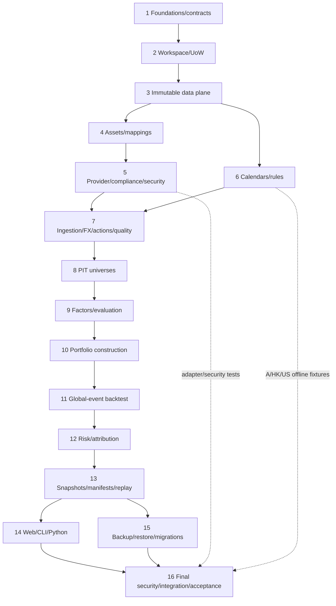

# Implementation Plan: Multi-Market Quant Platform

## Overview

Implement the Python modular-monolith MVP defined by `requirements.md` and `design.md`. Work proceeds from stable contracts and immutable storage through market semantics, research kernels, simulation, interfaces, and recovery. Every task below is required for MVP acceptance; none is optional. Tasks implement only local daily/low-frequency research and simulation—never real trading, intraday/HFT, derivatives, cloud/distributed processing, or multi-user SaaS.

Each leaf task is a code-generation prompt with explicit file ownership, prerequisites, outputs, validation, and traceability. A coding agent must read `requirements.md`, `design.md`, and all prerequisite task outputs before editing. It must not broaden public contracts beyond the MVP.

## Tasks

- [x] 1. Establish the Python project and stable architecture contracts
  - [x] 1.1 Create the pinned Python project, package skeleton, and quality toolchain
    - **Files/modules:** `pyproject.toml`, lockfile, `src/mmqp/**/__init__.py`, `tests/conftest.py`, `.python-version`, CI configuration.
    - **Prerequisites:** none.
    - **Expected outputs:** installable `mmqp` package with Python, Ruff, mypy, pytest, Hypothesis, coverage, SQLite, PyArrow, DuckDB, FastAPI, Typer, NumPy/SciPy and CVXPY dependencies pinned; deterministic single-thread test environment; macOS and hermetic pure-domain test jobs.
    - **Focused validation:** `python -m pip install -e '.[dev]' && python -m ruff check src tests && python -m mypy src/mmqp && python -m pytest --collect-only -q`.
    - **Traceability:** Requirements 1.1, 17.2, 17.4, 20.1; design Architecture / Module topology, Compatibility and packaging, Testing Strategy.
  - [x] 1.2 Implement common immutable domain primitives, canonical serialization, numeric policy, and closed error model
    - **Files/modules:** `src/mmqp/domain/common.py`, `identifiers.py`, `intervals.py`, `numeric.py`, `errors.py`, `serialization.py`; focused unit tests under `tests/unit/domain/`.
    - **Prerequisites:** 1.1.
    - **Expected outputs:** UUID/content IDs, aware timestamps, inclusive intervals, ISO currency, Decimal bounds/rounding, canonical JSON/hash, immutable DTO base, `ProblemV1`, unavailable/rejected result types, and stable CLI/HTTP error categories.
    - **Focused validation:** `python -m pytest tests/unit/domain -q && python -m mypy src/mmqp/domain`.
    - **Traceability:** Requirements 2.6, 3.9, 4.5, 6.1-6.2, 17.3, 17.11-17.12; design Deterministic numeric policy, Error Handling.
  - [x] 1.3 Define versioned internal ports and command/query DTO contracts
    - **Files/modules:** `src/mmqp/ports/*.py`, `src/mmqp/application/dto/*.py`, `tests/contract/test_port_shapes.py`.
    - **Prerequisites:** 1.2.
    - **Expected outputs:** typed V1 protocols for workspace, content store, assets, providers/compliance/credentials, calendars/rules, ingestion, FX, quality, universes, factors, portfolios, backtest, risk, attribution, snapshots/experiments, query, backup, clock; no real-order or arbitrary-code primitive.
    - **Focused validation:** `python -m pytest tests/contract/test_port_shapes.py -q && python -m mypy src/mmqp/ports src/mmqp/application/dto`.
    - **Traceability:** Requirements 1.5, 1.7, 18.1-18.2, 18.15; design Stable internal ports, Explicit exclusions.
  - [x] 1.4 Add architecture and forbidden-surface enforcement
    - **Files/modules:** `tests/architecture/test_dependencies.py`, `test_forbidden_surface.py`, import-linter configuration.
    - **Prerequisites:** 1.3.
    - **Expected outputs:** automated enforcement of `interfaces/adapters -> application -> ports/domain/kernels`, domain dependency freedom, and absence of brokerage, real-order, intraday, short/leverage, derivatives, cloud/distributed and multi-user mutation surfaces.
    - **Focused validation:** `python -m pytest tests/architecture -q`.
    - **Traceability:** Requirements 1.5, 1.7, 14.18, 18.15; design Non-goals, `S-SURFACE`.

- [x] 2. Implement workspace isolation and atomic mutation
  - [x] 2.1 Implement workspace registry, canonical path conflict detection, UID binding, create/open
    - **Files/modules:** `src/mmqp/domain/workspace.py`, `application/workspaces.py`, `adapters/sqlite/workspace_registry.py`, `adapters/filesystem/paths.py`, `tests/unit/workspace/test_registry.py`.
    - **Prerequisites:** 1.3.
    - **Expected outputs:** macOS-aware real-path/Unicode/case normalization; distinct IDs and non-overlapping paths; one bound UID; safe create/open with complete conflict diagnostics.
    - **Focused validation:** `python -m pytest tests/unit/workspace/test_registry.py -q`.
    - **Traceability:** Requirements 1.1-1.2, 1.8-1.10; Properties 2.
  - [x] 2.2 Implement workspace lock, intent log, staged publication, and `WorkspaceUnitOfWork`
    - **Files/modules:** `src/mmqp/application/uow.py`, `adapters/sqlite/uow.py`, `adapters/filesystem/locking.py`, `publication.py`, `tests/unit/workspace/test_uow.py`.
    - **Prerequisites:** 2.1.
    - **Expected outputs:** UID authorization, exclusive lock, `BEGIN IMMEDIATE`, operation intent, staged-object verification, atomic rename/reference commit, rollback, fsync, and recoverable orphan semantics.
    - **Focused validation:** `python -m pytest tests/unit/workspace/test_uow.py -q`.
    - **Traceability:** Requirements 1.3-1.4, 1.7; Property 1.
  - [x] 2.3 Write the primary Hypothesis test for Property 1: authorized mutation is atomic
    - **Files/modules:** `tests/property/workspace/test_p01_authorized_mutation_atomic.py`.
    - **Prerequisites:** 2.2.
    - **Expected outputs:** exactly one primary Hypothesis test/state machine tagged `# Feature: multi-market-quant-platform, Property 1: Authorized mutation is atomic`, covering identities, commands and injected failures with complete-state comparison and zero external transaction effects.
    - **Focused validation:** `python -m pytest tests/property/workspace/test_p01_authorized_mutation_atomic.py -q`.
    - **Traceability:** Requirements 1.3, 1.4, 1.7; Property 1.
  - [x] 2.4 Write the primary Hypothesis test for Property 2: workspace identities and paths never overlap
    - **Files/modules:** `tests/property/workspace/test_p02_workspace_paths.py`.
    - **Prerequisites:** 2.1.
    - **Expected outputs:** exactly one primary Hypothesis test tagged for Property 2 generating normalized equal/ancestor/descendant paths and ID collisions.
    - **Focused validation:** `python -m pytest tests/property/workspace/test_p02_workspace_paths.py -q`.
    - **Traceability:** Requirements 1.8, 1.10; Property 2.
  - [x] 2.5 Add real-filesystem/SQLite workspace integration and crash-atomicity tests
    - **Files/modules:** `tests/integration/workspace/test_workspace_uow.py`, fault-injection helpers.
    - **Prerequisites:** 2.2.
    - **Expected outputs:** `I-WS` coverage for create/open/reopen, UID rejection, process lock, conflict privacy, crash points, rollback, and unchanged existing workspaces.
    - **Focused validation:** `python -m pytest tests/integration/workspace/test_workspace_uow.py -q`.
    - **Traceability:** Requirements 1.1-1.4, 1.9-1.10; design `I-WS`.

- [x] 3. Build the immutable SQLite/Parquet/DuckDB data plane
  - [x] 3.1 Create the baseline SQLite schema, migration runner, immutable triggers, and repositories
    - **Files/modules:** `src/mmqp/migrations/0001_control.sql`, `adapters/sqlite/schema.py`, `repositories.py`, `tests/integration/storage/test_sqlite_immutability.py`.
    - **Prerequisites:** 2.2.
    - **Expected outputs:** strict tables, foreign keys, immutable version rows, separate current pointers, overlap indexes, migration checksums, and update/delete denial.
    - **Focused validation:** `python -m pytest tests/integration/storage/test_sqlite_immutability.py -q`.
    - **Traceability:** Requirements 2.14, 3.10, 9.14-9.15, 17.15; design Core SQLite aggregates, `I-IMMUTABLE`.
  - [x] 3.2 Implement canonical Arrow schemas and content-addressed Parquet object storage
    - **Files/modules:** `src/mmqp/adapters/parquet/schemas.py`, `content_store.py`, `manifests.py`, `tests/integration/storage/test_parquet_content_store.py`.
    - **Prerequisites:** 2.2, 3.1.
    - **Expected outputs:** deterministic column/order metadata, fixed Decimals, canonical IPC hash and physical hash, stage/verify/publish, schema/count/checksum manifests, immutable object paths.
    - **Focused validation:** `python -m pytest tests/integration/storage/test_parquet_content_store.py -q`.
    - **Traceability:** Requirements 7.16-7.17, 9.14-9.15, 17.3-17.4; design Control/data plane, Canonical Arrow/Parquet schemas.
  - [x] 3.3 Implement the restricted read-only DuckDB adapter
    - **Files/modules:** `src/mmqp/adapters/duckdb/engine.py`, `query_compiler.py`, `tests/integration/storage/test_duckdb_sandbox.py`.
    - **Prerequisites:** 3.2, 1.3.
    - **Expected outputs:** in-memory read-only engine, external access and extension loading disabled, snapshot-path view registration, typed predicates only, parameterized SQL, memory/thread limits and `LIMIT 10001` support.
    - **Focused validation:** `python -m pytest tests/integration/storage/test_duckdb_sandbox.py -q`.
    - **Traceability:** Requirements 18.4-18.9, 18.14-18.16; design Read-only analytics and query contract.
  - [x] 3.4 Add publication fault-injection and immutable-history integration tests
    - **Files/modules:** `tests/integration/storage/test_publication_failures.py`, `test_immutable_history.py`.
    - **Prerequisites:** 3.1, 3.2.
    - **Expected outputs:** proof that schema/hash/rename/SQLite failures publish no partial references, retain prior versions, and leave only unreachable recoverable objects.
    - **Focused validation:** `python -m pytest tests/integration/storage/test_publication_failures.py tests/integration/storage/test_immutable_history.py -q`.
    - **Traceability:** Requirements 9.14-9.15, 17.15; design `I-IMMUTABLE`.

- [x] 4. Implement canonical assets and effective mappings
  - [x] 4.1 Implement canonical asset registration and effective-dated Asset Master history
    - **Files/modules:** `src/mmqp/domain/assets.py`, `application/assets.py`, `adapters/sqlite/assets.py`, `tests/unit/assets/test_asset_registry.py`.
    - **Prerequisites:** 3.1.
    - **Expected outputs:** supported-type validation, tuple-based stable IDs, all-error reporting, immutable successor versions, historical as-of lookup including delisted/terminated assets.
    - **Focused validation:** `python -m pytest tests/unit/assets/test_asset_registry.py -q`.
    - **Traceability:** Requirements 2.1-2.7, 2.13-2.14; Properties 3-4.
  - [x] 4.2 Implement effective provider-code mappings and three-way resolution
    - **Files/modules:** `src/mmqp/domain/provider_mappings.py`, `application/provider_mappings.py`, `adapters/sqlite/provider_mappings.py`, `tests/unit/assets/test_provider_mappings.py`.
    - **Prerequisites:** 4.1.
    - **Expected outputs:** immutable interval mappings, full validation, exact resolved/unresolved/ambiguous results with all matching evidence.
    - **Focused validation:** `python -m pytest tests/unit/assets/test_provider_mappings.py -q`.
    - **Traceability:** Requirements 2.8-2.12; Property 5.
  - [x] 4.3 Write the primary Hypothesis test for Property 3: canonical identity is idempotent and discriminating
    - **Files/modules:** `tests/property/assets/test_p03_canonical_identity.py`.
    - **Prerequisites:** 4.1.
    - **Expected outputs:** exactly one tagged primary Hypothesis test generating valid identity tuples, repetitions and single-component changes.
    - **Focused validation:** `python -m pytest tests/property/assets/test_p03_canonical_identity.py -q`.
    - **Traceability:** Requirements 2.1-2.4; Property 3.
  - [x] 4.4 Write the primary Hypothesis test for Property 4: Asset Master history is valid and point-selectable
    - **Files/modules:** `tests/property/assets/test_p04_asset_master_history.py`.
    - **Prerequisites:** 4.1.
    - **Expected outputs:** exactly one tagged stateful/property test over valid/invalid changes and as-of dates, asserting immutable history and all-or-nothing rejection.
    - **Focused validation:** `python -m pytest tests/property/assets/test_p04_asset_master_history.py -q`.
    - **Traceability:** Requirements 2.5-2.7, 2.13-2.14; Property 4.
  - [x] 4.5 Write the primary Hypothesis test for Property 5: provider mapping three-way resolution
    - **Files/modules:** `tests/property/assets/test_p05_provider_mapping_resolution.py`.
    - **Prerequisites:** 4.2.
    - **Expected outputs:** exactly one tagged primary test over interval sets and invalid commands, checking sole/unresolved/ambiguous output completeness.
    - **Focused validation:** `python -m pytest tests/property/assets/test_p05_provider_mapping_resolution.py -q`.
    - **Traceability:** Requirements 2.8-2.12; Property 5.

- [x] 5. Implement provider, compliance, credential, and network boundaries
  - [x] 5.1 Implement adapter capability descriptors, contract compatibility, request limits, and categorized errors
    - **Files/modules:** `src/mmqp/domain/providers.py`, `ports/provider.py`, `application/providers.py`, `adapters/http_provider/base.py`, `tests/unit/providers/test_capabilities.py`.
    - **Prerequisites:** 1.3, 3.1.
    - **Expected outputs:** one V1 contract version, complete/unknown capabilities, bounded limits, enable-after-display flow, hard 30-second timeout and normalized timeout/throttle/unavailable errors.
    - **Focused validation:** `python -m pytest tests/unit/providers/test_capabilities.py -q`.
    - **Traceability:** Requirements 3.1-3.6, 3.15-3.16; Property 6.
  - [x] 5.2 Implement immutable compliance profiles and per-request retention/export gates
    - **Files/modules:** `src/mmqp/domain/compliance.py`, `application/compliance.py`, `adapters/sqlite/compliance.py`, `tests/unit/providers/test_compliance.py`.
    - **Prerequisites:** 5.1.
    - **Expected outputs:** complete profile validation/versioning, exact request-time binding, zero persistence/export on prohibition, and one provenance/profile pair per persisted observation.
    - **Focused validation:** `python -m pytest tests/unit/providers/test_compliance.py -q`.
    - **Traceability:** Requirements 3.7-3.14; Property 7.
  - [x] 5.3 Implement Keychain credentials, redaction gate, scoped HTTPS egress, and subset-atomic deletion
    - **Files/modules:** `src/mmqp/domain/security.py`, `application/security.py`, `adapters/keychain/macos.py`, `adapters/http_provider/policy.py`, `adapters/redaction/gate.py`, `tests/unit/security/`.
    - **Prerequisites:** 5.1.
    - **Expected outputs:** secrets outside workspace/VCS and same UID only; fail-closed sink redaction; exact HTTPS origin/path/redirect checks before sensitive bytes; telemetry off; independent credential deletion choices and rollback on failure.
    - **Focused validation:** `python -m pytest tests/unit/security -q`.
    - **Traceability:** Requirements 19.1-19.15; Properties 48-49.
  - [x] 5.4 Write the primary Hypothesis test for Property 6: adapter/compliance descriptors normalize completely
    - **Files/modules:** `tests/property/providers/test_p06_descriptor_normalization.py`.
    - **Prerequisites:** 5.1, 5.2.
    - **Expected outputs:** exactly one tagged primary test for omitted capabilities, limit boundaries and immutable compliance successor normalization.
    - **Focused validation:** `python -m pytest tests/property/providers/test_p06_descriptor_normalization.py -q`.
    - **Traceability:** Requirements 3.1-3.2, 3.4-3.5, 3.8, 3.10; Property 6.
  - [x] 5.5 Write the primary Hypothesis test for Property 7: provider policy gates every side effect
    - **Files/modules:** `tests/property/providers/test_p07_provider_policy_gate.py`.
    - **Prerequisites:** 5.2.
    - **Expected outputs:** exactly one tagged stateful/property test varying adapter/profile/request/retention/export outcomes and asserting sent bytes, persisted state and provenance.
    - **Focused validation:** `python -m pytest tests/property/providers/test_p07_provider_policy_gate.py -q`.
    - **Traceability:** Requirements 3.6-3.7, 3.9, 3.11-3.14; Property 7.
  - [x] 5.6 Write the primary Hypothesis test for Property 48: redaction and network scope fail closed
    - **Files/modules:** `tests/property/security/test_p48_redaction_network_scope.py`.
    - **Prerequisites:** 5.3.
    - **Expected outputs:** exactly one tagged primary test generating credential representations, origins, encoded/traversal paths, redirects and destinations; no credential leakage or out-of-scope bytes.
    - **Focused validation:** `python -m pytest tests/property/security/test_p48_redaction_network_scope.py -q`.
    - **Traceability:** Requirements 19.4-19.5, 19.7-19.10, 19.14-19.15; Property 48.
  - [x] 5.7 Write the primary Hypothesis test for Property 49: credential deletion is subset-exact and atomic
    - **Files/modules:** `tests/property/security/test_p49_credential_deletion.py`.
    - **Prerequisites:** 5.3.
    - **Expected outputs:** exactly one tagged stateful/property test over credential sets, selected subsets and injected failures.
    - **Focused validation:** `python -m pytest tests/property/security/test_p49_credential_deletion.py -q`.
    - **Traceability:** Requirements 19.11-19.13; Property 49.
  - [x] 5.8 Build the provider adapter conformance suite and offline fake HTTPS adapter
    - **Files/modules:** `tests/contract/providers/test_adapter_v1.py`, `tests/fixtures/providers/**`, `tests/integration/providers/test_provider_flow.py`.
    - **Prerequisites:** 5.1-5.3.
    - **Expected outputs:** reusable adapter contract vectors; local TLS provider fixtures; capability-before-send, credential unavailable, timeout/throttle/unavailable, redirect/scope, prohibited retention/export and no-persistence assertions; no external network dependency.
    - **Focused validation:** `python -m pytest tests/contract/providers tests/integration/providers -q`.
    - **Traceability:** Requirements 3.1-3.16, 19.6-19.10; design `I-PROVIDER`, `S-PROVIDER`, `SEC-NET`, `SEC-KEYCHAIN`.

- [x] 6. Implement calendars, time zones, market rules, and offline market fixtures
  - [x] 6.1 Implement effective trading/valuation calendars, aware timestamp interpretation, and alignment
    - **Files/modules:** `src/mmqp/domain/calendars.py`, `application/calendars.py`, `adapters/sqlite/calendars.py`, `tests/unit/calendars/test_calendar_service.py`.
    - **Prerequisites:** 3.1.
    - **Expected outputs:** exact market IANA zones, New York DST, unique version selection, closed/full/half and 0-8 ordered non-overlapping sessions, split days, valuation calendars and PIT alignment evidence.
    - **Focused validation:** `python -m pytest tests/unit/calendars/test_calendar_service.py -q`.
    - **Traceability:** Requirements 4.1-4.15; Properties 8-9.
  - [x] 6.2 Implement effective market-rule profiles and pure lot/tick/session/sell/settlement evaluators
    - **Files/modules:** `src/mmqp/domain/market_rules.py`, `application/market_rules.py`, `kernels/market_rules.py`, `adapters/sqlite/market_rules.py`, `tests/unit/market_rules/`.
    - **Prerequisites:** 6.1.
    - **Expected outputs:** unique profile lookup, profile validation, Decimal lot/tick flooring, price-limit/band/halt/session rules, A-share next-open sell availability, configured HK/US same-day availability, independent idempotent settlement clocks, regular-only execution.
    - **Focused validation:** `python -m pytest tests/unit/market_rules -q`.
    - **Traceability:** Requirements 5.1-5.20; Properties 10-12.
  - [x] 6.3 Create offline A-share, Hong Kong, and US/DST calendar/rule golden fixtures
    - **Files/modules:** `tests/fixtures/markets/{a_share,hk,us}/**`, `tests/golden/test_market_semantics.py`.
    - **Prerequisites:** 6.1, 6.2.
    - **Expected outputs:** versioned local fixtures covering holidays, half/split sessions, Shanghai/Hong Kong zones, New York spring/fall DST, lots/ticks, T+1 sell, same-day sell option, settlement, halts/bands and excluded US extended hours.
    - **Focused validation:** `python -m pytest tests/golden/test_market_semantics.py -q`.
    - **Traceability:** Requirements 4.2-4.8, 5.5-5.6, 5.11-5.20; design golden strategy, `S-BACKTEST`.
  - [x] 6.4 Write the primary Hypothesis test for Property 8: calendar interpretation is unique and timezone-correct
    - **Files/modules:** `tests/property/calendars/test_p08_calendar_interpretation.py`.
    - **Prerequisites:** 6.1.
    - **Expected outputs:** exactly one tagged primary test generating aware/naive timestamps, DST instants, intervals and valid/invalid sessions.
    - **Focused validation:** `python -m pytest tests/property/calendars/test_p08_calendar_interpretation.py -q`.
    - **Traceability:** Requirements 4.1-4.12; Property 8.
  - [x] 6.5 Write the primary Hypothesis test for Property 9: cross-market alignment preserves source semantics
    - **Files/modules:** `tests/property/calendars/test_p09_cross_market_alignment.py`.
    - **Prerequisites:** 6.1.
    - **Expected outputs:** exactly one tagged primary test over source dates, alignment dates, availability instants and filters.
    - **Focused validation:** `python -m pytest tests/property/calendars/test_p09_cross_market_alignment.py -q`.
    - **Traceability:** Requirements 4.13-4.15; Property 9.
  - [x] 6.6 Write the primary Hypothesis test for Property 10: market-rule lookup and lot/tick flooring are exact
    - **Files/modules:** `tests/property/market_rules/test_p10_rule_lookup_flooring.py`.
    - **Prerequisites:** 6.2.
    - **Expected outputs:** exactly one tagged primary test over profile cardinality, Decimal prices, signed quantities and invalid profiles.
    - **Focused validation:** `python -m pytest tests/property/market_rules/test_p10_rule_lookup_flooring.py -q`.
    - **Traceability:** Requirements 5.1-5.4, 5.7-5.10; Property 10.
  - [x] 6.7 Write the primary Hypothesis test for Property 11: non-tradable requests never mutate ledgers
    - **Files/modules:** `tests/property/market_rules/test_p11_nontradable_no_mutation.py`.
    - **Prerequisites:** 6.2.
    - **Expected outputs:** exactly one tagged stateful/property test for limit/band/halt/session/sell availability outcomes and US extended-hours exclusion.
    - **Focused validation:** `python -m pytest tests/property/market_rules/test_p11_nontradable_no_mutation.py -q`.
    - **Traceability:** Requirements 5.11-5.17; Property 11.
  - [x] 6.8 Write the primary Hypothesis test for Property 12: sell availability and settlement are independent idempotent clocks
    - **Files/modules:** `tests/property/market_rules/test_p12_sell_settlement_clocks.py`.
    - **Prerequisites:** 6.2.
    - **Expected outputs:** exactly one tagged stateful/property test varying markets/calendars/rules and duplicate due events.
    - **Focused validation:** `python -m pytest tests/property/market_rules/test_p12_sell_settlement_clocks.py -q`.
    - **Traceability:** Requirements 5.5-5.6, 5.18-5.20; Property 12.
  - [x] 6.9 Checkpoint — validate foundations and market semantics
    - **Files/modules:** no source edits; validation artifacts only.
    - **Prerequisites:** 1.1-6.8.
    - **Expected outputs:** all foundation, workspace, storage, asset, provider/security, calendar, market-rule, contract and offline-fixture tests pass before data/research work begins; ask the user if questions arise.
    - **Focused validation:** `python -m pytest tests/architecture tests/unit/workspace tests/integration/workspace tests/integration/storage tests/unit/assets tests/contract/providers tests/integration/providers tests/unit/calendars tests/unit/market_rules tests/golden -q`.
    - **Traceability:** Requirements 1.1-1.10, 2.1-2.14, 3.1-3.16, 4.1-4.15, 5.1-5.20, 18.15, 19.1-19.15; Properties 1-12, 48-49.

- [x] 7. Implement ingestion, PIT facts, corporate actions, FX, and quality
  - [x] 7.1 Implement normalized Daily Bar, Fund NAV, and PIT Fundamental Fact ingestion/versioning
    - **Files/modules:** `src/mmqp/domain/ingestion.py`, `application/ingestion.py`, `adapters/sqlite/data_versions.py`, `adapters/parquet/ingestion.py`, `tests/unit/ingestion/`.
    - **Prerequisites:** 3.2, 4.2, 5.2, 6.1.
    - **Expected outputs:** atomic field/calendar validation, current logical-key uniqueness, immutable revisions/PIT selection, expected-date incremental segments, canonical equality reuse and successor publication.
    - **Focused validation:** `python -m pytest tests/unit/ingestion -q`.
    - **Traceability:** Requirements 7.1-7.17; Properties 15-17.
  - [x] 7.2 Implement immutable corporate actions, adjustment series, and idempotent holding effects
    - **Files/modules:** `src/mmqp/domain/corporate_actions.py`, `application/corporate_actions.py`, `adapters/sqlite/corporate_actions.py`, `kernels/adjustments.py`, `tests/unit/corporate_actions/`.
    - **Prerequisites:** 3.2, 7.1.
    - **Expected outputs:** versioned actions, unchanged raw bytes, explicit adjustment modes/factors/evidence, conflict rejection, once-only split/distribution effects, and never-derived cumulative NAV.
    - **Focused validation:** `python -m pytest tests/unit/corporate_actions -q`.
    - **Traceability:** Requirements 8.1-8.14; Properties 18-19.
  - [x] 7.3 Implement versioned FX storage, policy selection, conversion, and inverse derivation
    - **Files/modules:** `src/mmqp/domain/fx.py`, `application/fx.py`, `adapters/sqlite/fx.py`, `kernels/fx.py`, `tests/unit/fx/`.
    - **Prerequisites:** 3.2, 6.1.
    - **Expected outputs:** immutable direct/inverse rates and provenance, identity conversion, exact-date/five-business-date fallback, unavailable evidence and separate local/FX components.
    - **Focused validation:** `python -m pytest tests/unit/fx -q`.
    - **Traceability:** Requirements 6.1-6.13; Properties 13-14, 42.
  - [x] 7.4 Implement pinned data-quality rules, reports, gap precedence, and rejected-snapshot confirmation gate
    - **Files/modules:** `src/mmqp/domain/quality.py`, `application/quality.py`, `adapters/sqlite/quality.py`, `adapters/parquet/quality.py`, `tests/unit/quality/`.
    - **Prerequisites:** 7.1, 6.1.
    - **Expected outputs:** complete issue evidence, maximum severity, four retained gap reasons and precedence, report reconciliation, immutable publication, exact snapshot/rejected-version confirmation checks.
    - **Focused validation:** `python -m pytest tests/unit/quality -q`.
    - **Traceability:** Requirements 9.1-9.15; Properties 20-21.
  - [x] 7.5 Write the primary Hypothesis test for Property 13: FX direct/inverse conversion round-trips
    - **Files/modules:** `tests/property/fx/test_p13_fx_round_trip.py`.
    - **Prerequisites:** 7.3.
    - **Expected outputs:** exactly one tagged primary test over bounded positive Decimals, direct/inverse provenance and base/non-base conversions.
    - **Focused validation:** `python -m pytest tests/property/fx/test_p13_fx_round_trip.py -q`.
    - **Traceability:** Requirements 6.2-6.6, 6.11, 6.13; Property 13.
  - [x] 7.6 Write the primary Hypothesis test for Property 14: FX policy selection is deterministic and bounded
    - **Files/modules:** `tests/property/fx/test_p14_fx_policy_selection.py`.
    - **Prerequisites:** 7.3.
    - **Expected outputs:** exactly one tagged primary test over rate histories and applicable business-date sets.
    - **Focused validation:** `python -m pytest tests/property/fx/test_p14_fx_policy_selection.py -q`.
    - **Traceability:** Requirements 6.1, 6.7-6.10; Property 14.
  - [x] 7.7 Write the primary Hypothesis test for Property 15: market observations validate and publish atomically
    - **Files/modules:** `tests/property/ingestion/test_p15_observation_atomicity.py`.
    - **Prerequisites:** 7.1.
    - **Expected outputs:** exactly one tagged primary test generating bar/NAV/fact records, calendar cardinality and multiple simultaneous violations.
    - **Focused validation:** `python -m pytest tests/property/ingestion/test_p15_observation_atomicity.py -q`.
    - **Traceability:** Requirements 7.1-7.8, 7.12-7.14; Property 15.
  - [x] 7.8 Write the primary Hypothesis test for Property 16: fundamental revisions are immutable and PIT-selected
    - **Files/modules:** `tests/property/ingestion/test_p16_fundamental_revisions.py`.
    - **Prerequisites:** 7.1.
    - **Expected outputs:** exactly one tagged stateful/property test over revision chains, tied availability times and decisions.
    - **Focused validation:** `python -m pytest tests/property/ingestion/test_p16_fundamental_revisions.py -q`.
    - **Traceability:** Requirements 7.9-7.11; Property 16.
  - [x] 7.9 Write the primary Hypothesis test for Property 17: increment planning and observation versioning are canonical
    - **Files/modules:** `tests/property/ingestion/test_p17_increment_versioning.py`.
    - **Prerequisites:** 7.1.
    - **Expected outputs:** exactly one tagged stateful/property test for maximal absent runs, byte-equal reuse and one-parent successors.
    - **Focused validation:** `python -m pytest tests/property/ingestion/test_p17_increment_versioning.py -q`.
    - **Traceability:** Requirements 7.15-7.17; Property 17.
  - [x] 7.10 Write the primary Hypothesis test for Property 18: adjustment is explicit, complete, and non-destructive
    - **Files/modules:** `tests/property/corporate_actions/test_p18_adjustment.py`.
    - **Prerequisites:** 7.2.
    - **Expected outputs:** exactly one tagged primary test over raw series, modes, factor completeness/bounds, conflicts and fund cumulative NAV availability.
    - **Focused validation:** `python -m pytest tests/property/corporate_actions/test_p18_adjustment.py -q`.
    - **Traceability:** Requirements 8.1-8.8, 8.12-8.14; Property 18.
  - [x] 7.11 Write the primary Hypothesis test for Property 19: corporate actions apply exactly once
    - **Files/modules:** `tests/property/corporate_actions/test_p19_apply_once.py`.
    - **Prerequisites:** 7.2.
    - **Expected outputs:** exactly one tagged stateful/property test over event kinds, holdings, withholding and duplicate deliveries.
    - **Focused validation:** `python -m pytest tests/property/corporate_actions/test_p19_apply_once.py -q`.
    - **Traceability:** Requirements 8.9-8.11; Property 19.
  - [x] 7.12 Write the primary Hypothesis test for Property 20: quality status and gap reason are deterministic maxima
    - **Files/modules:** `tests/property/quality/test_p20_quality_gap_precedence.py`.
    - **Prerequisites:** 7.4.
    - **Expected outputs:** exactly one tagged primary test over rules, severities, gap-condition combinations and report reconciliation.
    - **Focused validation:** `python -m pytest tests/property/quality/test_p20_quality_gap_precedence.py -q`.
    - **Traceability:** Requirements 9.1-9.11; Property 20.
  - [x] 7.13 Write the primary Hypothesis test for Property 21: rejected-data confirmation is exact
    - **Files/modules:** `tests/property/quality/test_p21_rejected_confirmation.py`.
    - **Prerequisites:** 7.4.
    - **Expected outputs:** exactly one tagged primary test over exact/subset/superset/other-snapshot confirmations and unchanged runs.
    - **Focused validation:** `python -m pytest tests/property/quality/test_p21_rejected_confirmation.py -q`.
    - **Traceability:** Requirements 9.12-9.13; Property 21.

- [x] 8. Implement PIT universes and bias controls
  - [x] 8.1 Implement immutable universe membership, PIT filters, and exclusion/warning evidence
    - **Validation:** `python -m pytest tests/unit/universes -q -p no:schemathesis`
    - **Files/modules:** `src/mmqp/domain/universes.py`, `application/universes.py`, `adapters/sqlite/universes.py`, `adapters/parquet/universes.py`, `tests/unit/universes/`.
    - **Prerequisites:** 4.1, 7.1, 7.4.
    - **Expected outputs:** effective membership selection, lifecycle/liquidity availability filtering, ambiguity/missing exclusion evidence, maximal incomplete ranges, survivorship/lookahead records and reconciled cross-section counts.
    - **Focused validation:** `python -m pytest tests/unit/universes -q`.
    - **Traceability:** Requirements 10.1-10.11; Property 22.
  - [x] 8.2 Write the primary Hypothesis test for Property 22: PIT universes exclude ambiguity and future data
    - **Validation:** `python -m pytest tests/property/universes -q -p no:schemathesis`
    - **Files/modules:** `tests/property/universes/test_p22_pit_universe.py`.
    - **Prerequisites:** 8.1.
    - **Expected outputs:** exactly one tagged primary test generating interval histories, unavailable dependencies, future liquidity and incomplete ranges.
    - **Focused validation:** `python -m pytest tests/property/universes/test_p22_pit_universe.py -q`.
    - **Traceability:** Requirements 10.1-10.11; Property 22.

- [x] 9. Implement factor definitions, kernels, and cross-sectional evaluation
  - [x] 9.1 Implement transformation specifications, factor definition validation, PIT execution, and persistence
    - **Files/modules:** `src/mmqp/domain/factors.py`, `application/factors.py`, `kernels/factors.py`, `adapters/parquet/factors.py`, `tests/unit/factors/test_definitions.py`.
    - **Prerequisites:** 7.4, 8.1.
    - **Expected outputs:** versioned allowlist and ordered plan validation, input/dependency resolution, visible-only windows, deterministic winsorization/z-score/neutralization, missing/undefined outputs and reproducible persisted Factor Values.
    - **Focused validation:** `python -m pytest tests/unit/factors/test_definitions.py -q`.
    - **Traceability:** Requirements 11.1-11.14; Properties 23-26.
  - [x] 9.2 Implement IC, tie ranks, quantiles, future returns, autocorrelation, turnover, and reports
    - **Files/modules:** `src/mmqp/domain/factor_evaluation.py`, `application/factor_evaluation.py`, `kernels/evaluation.py`, `tests/unit/factors/test_evaluation.py`.
    - **Prerequisites:** 9.1.
    - **Expected outputs:** exact aligned formulas, typed undefined outcomes, deterministic Canonical-ID tie ordering, strict post-decision endpoints, weighted returns and complete evaluation metadata.
    - **Focused validation:** `python -m pytest tests/unit/factors/test_evaluation.py -q`.
    - **Traceability:** Requirements 12.1-12.13; Properties 27-29.
  - [x] 9.3 Write the primary Hypothesis test for Property 23: factor definitions/dependencies are all-or-nothing
    - **Files/modules:** `tests/property/factors/test_p23_definition_dependencies.py`.
    - **Prerequisites:** 9.1.
    - **Expected outputs:** exactly one tagged primary test over bounds, fields, transformations, visibility and missing/ambiguous dependencies.
    - **Focused validation:** `python -m pytest tests/property/factors/test_p23_definition_dependencies.py -q`.
    - **Traceability:** Requirements 11.1-11.7, 11.9, 11.12-11.13; Property 23.
  - [x] 9.4 Write the primary Hypothesis test for Property 24: winsorization equals indexed clamping
    - **Files/modules:** `tests/property/factors/test_p24_winsorization.py`.
    - **Prerequisites:** 9.1.
    - **Expected outputs:** exactly one tagged primary test comparing generated non-empty cross-sections to the one-based reference formula.
    - **Focused validation:** `python -m pytest tests/property/factors/test_p24_winsorization.py -q`.
    - **Traceability:** Requirement 11.8; Property 24.
  - [x] 9.5 Write the primary Hypothesis test for Property 25: z-score follows the population formula
    - **Files/modules:** `tests/property/factors/test_p25_zscore.py`.
    - **Prerequisites:** 9.1.
    - **Expected outputs:** exactly one tagged primary test for finite positive-dispersion values and undefined small/constant sets at `1e-12`.
    - **Focused validation:** `python -m pytest tests/property/factors/test_p25_zscore.py -q`.
    - **Traceability:** Requirements 11.10-11.11; Property 25.
  - [x] 9.6 Write the primary Hypothesis test for Property 26: repeated factor evaluation is reproducible
    - **Files/modules:** `tests/property/factors/test_p26_factor_reproducibility.py`.
    - **Prerequisites:** 9.1.
    - **Expected outputs:** exactly one tagged primary test rerunning identical complete inputs and comparing statuses/numerics at required tolerance.
    - **Focused validation:** `python -m pytest tests/property/factors/test_p26_factor_reproducibility.py -q`.
    - **Traceability:** Requirement 11.14; Property 26.
  - [x] 9.7 Write the primary Hypothesis test for Property 27: correlation kernels use exact aligned sets and tie ranks
    - **Files/modules:** `tests/property/factors/test_p27_correlations.py`.
    - **Prerequisites:** 9.2.
    - **Expected outputs:** exactly one tagged primary test against independent Pearson/average-rank references and invalid-input outcomes.
    - **Focused validation:** `python -m pytest tests/property/factors/test_p27_correlations.py -q`.
    - **Traceability:** Requirements 12.1-12.3, 12.8-12.9; Property 27.
  - [x] 9.8 Write the primary Hypothesis test for Property 28: quantile allocation and return are deterministic
    - **Files/modules:** `tests/property/factors/test_p28_quantiles.py`.
    - **Prerequisites:** 9.2.
    - **Expected outputs:** exactly one tagged primary test over ties, Q bounds, weights and missing returns.
    - **Focused validation:** `python -m pytest tests/property/factors/test_p28_quantiles.py -q`.
    - **Traceability:** Requirements 12.4-12.7; Property 28.
  - [x] 9.9 Write the primary Hypothesis test for Property 29: future returns and turnover use specified endpoints/union
    - **Files/modules:** `tests/property/factors/test_p29_future_return_turnover.py`.
    - **Prerequisites:** 9.2.
    - **Expected outputs:** exactly one tagged primary test over endpoint streams, holdings periods and consecutive sparse portfolios.
    - **Focused validation:** `python -m pytest tests/property/factors/test_p29_future_return_turnover.py -q`.
    - **Traceability:** Requirements 12.10-12.13; Property 29.
  - [x] 9.10 Checkpoint — validate data, universe, and factor layers
    - **Files/modules:** no source edits; validation artifacts only.
    - **Prerequisites:** 7.1-9.9.
    - **Expected outputs:** all ingestion, corporate-action, FX, quality, universe, factor and evaluation tests pass before portfolio/backtest work begins; ask the user if questions arise.
    - **Focused validation:** `python -m pytest tests/unit/ingestion tests/unit/corporate_actions tests/unit/fx tests/unit/quality tests/unit/universes tests/unit/factors tests/property/ingestion tests/property/corporate_actions tests/property/fx tests/property/quality tests/property/universes tests/property/factors -q`.
    - **Traceability:** Requirements 6.1-6.13, 7.1-7.17, 8.1-8.14, 9.1-9.15, 10.1-10.11, 11.1-11.14, 12.1-12.13; Properties 13-29.

- [x] 10. Implement deterministic portfolio construction
  - [x] 10.1 Implement portfolio definitions, score weighting, approved optimization, independent Decimal validation, and deterministic tie-breaking
    - **Files/modules:** `src/mmqp/domain/portfolios.py`, `application/portfolios.py`, `kernels/portfolio.py`, `adapters/parquet/portfolios.py`, `tests/unit/portfolios/`.
    - **Prerequisites:** 8.1, 9.1, 7.3.
    - **Expected outputs:** long-only/cash constraints, group/count/turnover limits, pinned solver/settings, lexicographic tie resolution, residual diagnostics, input/version records, unsupported-request rejection and repeatability.
    - **Focused validation:** `python -m pytest tests/unit/portfolios -q`.
    - **Traceability:** Requirements 13.1-13.11, 13.13-13.14; Properties 30-31.
  - [x] 10.2 Implement deterministic minimum-cardinality infeasible-subset diagnostics
    - **Files/modules:** `src/mmqp/kernels/infeasibility.py`, `tests/unit/portfolios/test_infeasibility.py`.
    - **Prerequisites:** 10.1.
    - **Expected outputs:** exact memoized branch-and-bound with monotonic pruning and ascending constraint IDs; no partial target publication; exhaustive small-system oracle tests.
    - **Focused validation:** `python -m pytest tests/unit/portfolios/test_infeasibility.py -q`.
    - **Traceability:** Requirement 13.12; Property 32.
  - [x] 10.3 Write the primary Hypothesis test for Property 30: every published target portfolio is independently feasible
    - **Files/modules:** `tests/property/portfolios/test_p30_target_feasibility.py`.
    - **Prerequisites:** 10.1.
    - **Expected outputs:** exactly one tagged primary Property 30 test generating accepted/invalid definitions and independently checking all weights, sums, groups, count, turnover and diagnostics.
    - **Focused validation:** `python -m pytest tests/property/portfolios/test_p30_target_feasibility.py -q`.
    - **Traceability:** Requirements 13.1-13.8, 13.10-13.11, 13.13; Property 30.
  - [x] 10.4 Write the primary Hypothesis test for Property 31: portfolio tie-breaking/repetition are deterministic
    - **Files/modules:** `tests/property/portfolios/test_p31_tie_repetition.py`.
    - **Prerequisites:** 10.1.
    - **Expected outputs:** exactly one tagged primary test comparing tractable generated cases to a rational-grid/model oracle and repeat runs.
    - **Focused validation:** `python -m pytest tests/property/portfolios/test_p31_tie_repetition.py -q`.
    - **Traceability:** Requirements 13.9, 13.14; Property 31.
  - [x] 10.5 Write the primary Hypothesis test for Property 32: infeasibility diagnostics are minimal and atomic
    - **Files/modules:** `tests/property/portfolios/test_p32_minimal_infeasibility.py`.
    - **Prerequisites:** 10.2.
    - **Expected outputs:** exactly one tagged primary test comparing small generated systems with exhaustive subset enumeration and state snapshots.
    - **Focused validation:** `python -m pytest tests/property/portfolios/test_p32_minimal_infeasibility.py -q`.
    - **Traceability:** Requirement 13.12; Property 32.

- [x] 11. Implement the global-event multi-market backtest and ledgers
  - [x] 11.1 Implement deterministic UTC event queue, fill pipeline, lots, cash/security ledgers, corporate actions, costs, and valuation
    - **Files/modules:** `src/mmqp/domain/backtest.py`, `application/backtest.py`, `kernels/event_queue.py`, `kernels/fills.py`, `kernels/ledger.py`, `adapters/parquet/backtest.py`, `tests/unit/backtest/`.
    - **Prerequisites:** 6.2, 7.2-7.4, 10.1.
    - **Expected outputs:** manifest-pin preflight, one decision/asset/market date, strictly later regular sessions, fixed event ordering, zero-fill immutability, maximal affordable lot, cost reconciliation, independent settlement, non-negative invariants, two valuation policies, asynchronous source dates, complete result bundle and unsupported-scope rejection.
    - **Focused validation:** `python -m pytest tests/unit/backtest -q`.
    - **Traceability:** Requirements 14.1-14.18 and 5.11-5.20; Properties 33-36.
  - [x] 11.2 Write the primary Hypothesis test for Property 33: decisions are PIT-valid and schedule strictly later sessions
    - **Files/modules:** `tests/property/backtest/test_p33_decision_scheduling.py`.
    - **Prerequisites:** 11.1.
    - **Expected outputs:** exactly one tagged state-machine/reference test covering pins, visibility, per-market decisions and unsupported strategy inputs.
    - **Focused validation:** `python -m pytest tests/property/backtest/test_p33_decision_scheduling.py -q`.
    - **Traceability:** Requirements 14.1-14.6, 14.18; Property 33.
  - [x] 11.3 Write the primary Hypothesis test for Property 34: event processing preserves ledger invariants
    - **Files/modules:** `tests/unit/backtest/test_event_processing.py`.
    - **Prerequisites:** 11.1.
    - **Expected outputs:** exactly one tagged RuleBasedStateMachine/reference-ledger test checking every event and required completed output.
    - **Focused validation:** `python -m pytest tests/property/backtest/test_p34_ledger_invariants.py -q`.
    - **Traceability:** Requirements 14.7-14.8, 14.10-14.11, 14.17; Property 34.
  - [x] 11.4 Write the primary Hypothesis test for Property 35: costs reconcile and purchase uses maximal affordable lot
    - **Files/modules:** `tests/property/backtest/test_p35_affordable_lot.py`.
    - **Prerequisites:** 11.1.
    - **Expected outputs:** exactly one tagged primary test comparing generated cost functions/requests with exhaustive lot enumeration.
    - **Focused validation:** `python -m pytest tests/property/backtest/test_p35_affordable_lot.py -q`.
    - **Traceability:** Requirements 14.9, 14.12-14.13; Property 35.
  - [x] 11.5 Write the primary Hypothesis test for Property 36: valuation policy is bounded and source-dated
    - **Files/modules:** `tests/property/backtest/test_p36_valuation_policy.py`.
    - **Prerequisites:** 11.1.
    - **Expected outputs:** exactly one tagged primary test over sparse prices, five-open-date bounds, FX histories and asynchronous markets.
    - **Focused validation:** `python -m pytest tests/property/backtest/test_p36_valuation_policy.py -q`.
    - **Traceability:** Requirements 14.14-14.16; Property 36.

- [x] 12. Implement risk and attribution
  - [x] 12.1 Implement aligned risk metrics, covariance validation/contributions, concentration, and reports
    - **Files/modules:** `src/mmqp/domain/risk.py`, `application/risk.py`, `kernels/risk.py`, `adapters/parquet/risk.py`, `tests/unit/risk/`.
    - **Prerequisites:** 11.1.
    - **Expected outputs:** exact alignment, volatility/drawdown/tracking error/beta, scaled PSD checks, covariance contribution reconciliation, concentration and dependency-specific unavailable metrics with complete metadata.
    - **Focused validation:** `python -m pytest tests/unit/risk -q`.
    - **Traceability:** Requirements 15.1-15.13; Properties 37-39.
  - [x] 12.2 Implement periodic return, contribution, Brinson-Fachler, FX decomposition, linking, and reports
    - **Files/modules:** `src/mmqp/domain/attribution.py`, `application/attribution.py`, `kernels/attribution.py`, `adapters/parquet/attribution.py`, `tests/unit/attribution/`.
    - **Prerequisites:** 11.1, 7.3.
    - **Expected outputs:** specified return/cost/cash/asset formulas, residual checks, active return, allocation/selection/interaction, local/FX separation, recursive geometric linking and dependency-specific unavailability.
    - **Focused validation:** `python -m pytest tests/unit/attribution -q`.
    - **Traceability:** Requirements 6.12, 16.1-16.16; Properties 40-43.
  - [x] 12.3 Write the primary Hypothesis test for Property 37: aligned-sample risk metrics equal reference formulas
    - **Files/modules:** `tests/property/risk/test_p37_aligned_metrics.py`.
    - **Prerequisites:** 12.1.
    - **Expected outputs:** exactly one tagged primary test against independent volatility/drawdown/tracking-error/beta references and undefined beta cases.
    - **Focused validation:** `python -m pytest tests/property/risk/test_p37_aligned_metrics.py -q`.
    - **Traceability:** Requirements 15.1-15.6; Property 37.
  - [x] 12.4 Write the primary Hypothesis test for Property 38: covariance acceptance/contributions reconcile
    - **Files/modules:** `tests/property/risk/test_p38_covariance.py`.
    - **Prerequisites:** 12.1.
    - **Expected outputs:** exactly one tagged primary test generating PSD/non-PSD, malformed/misaligned matrices and checking contribution sums.
    - **Focused validation:** `python -m pytest tests/property/risk/test_p38_covariance.py -q`.
    - **Traceability:** Requirements 15.7-15.10; Property 38.
  - [x] 12.5 Write the primary Hypothesis test for Property 39: concentration and dependencies are explicit
    - **Files/modules:** `tests/property/risk/test_p39_concentration.py`.
    - **Prerequisites:** 12.1.
    - **Expected outputs:** exactly one tagged primary test over values/classifications/missing inputs and report metadata.
    - **Focused validation:** `python -m pytest tests/property/risk/test_p39_concentration.py -q`.
    - **Traceability:** Requirements 15.11-15.13; Property 39.
  - [x] 12.6 Write the primary Hypothesis test for Property 40: period return/basic contributions reconcile
    - **Files/modules:** `tests/property/attribution/test_p40_period_contributions.py`.
    - **Prerequisites:** 12.2.
    - **Expected outputs:** exactly one tagged primary test over values, timed flows, costs and unavailable denominators.
    - **Focused validation:** `python -m pytest tests/property/attribution/test_p40_period_contributions.py -q`.
    - **Traceability:** Requirements 16.1-16.7; Property 40.
  - [x] 12.7 Write the primary Hypothesis test for Property 41: Brinson-Fachler effects reconcile
    - **Files/modules:** `tests/property/attribution/test_p41_brinson_fachler.py`.
    - **Prerequisites:** 12.2.
    - **Expected outputs:** exactly one tagged primary test over aligned group weights/returns and `1e-10` residual.
    - **Focused validation:** `python -m pytest tests/property/attribution/test_p41_brinson_fachler.py -q`.
    - **Traceability:** Requirements 16.8-16.11; Property 41.
  - [x] 12.8 Write the primary Hypothesis test for Property 42: local/FX attribution obeys multiplicative identity
    - **Files/modules:** `tests/property/attribution/test_p42_local_fx.py`.
    - **Prerequisites:** 12.2.
    - **Expected outputs:** exactly one tagged primary test over finite local/FX returns and asset weights, retaining separate components.
    - **Focused validation:** `python -m pytest tests/property/attribution/test_p42_local_fx.py -q`.
    - **Traceability:** Requirements 6.12, 16.12-16.13; Property 42.
  - [x] 12.9 Write the primary Hypothesis test for Property 43: linked attribution reconciles and degrades by dependency
    - **Files/modules:** `tests/property/attribution/test_p43_linked_attribution.py`.
    - **Prerequisites:** 12.2.
    - **Expected outputs:** exactly one tagged primary test over contribution sequences and missing/non-finite/misaligned dependencies.
    - **Focused validation:** `python -m pytest tests/property/attribution/test_p43_linked_attribution.py -q`.
    - **Traceability:** Requirements 16.14-16.16; Property 43.

- [x] 13. Implement snapshots, manifests, replay, and comparison
  - [x] 13.1 Implement content-derived snapshots and manifest-before-result experiment runner
    - **Files/modules:** `src/mmqp/domain/experiments.py`, `application/experiments.py`, `adapters/sqlite/experiments.py`, `adapters/filesystem/manifests.py`, `tests/unit/experiments/`.
    - **Prerequisites:** 3.2, 7.4, 9.1, 10.1, 11.1, 12.1, 12.2.
    - **Expected outputs:** canonical ordered snapshot IDs, complete exact pin resolution, immutable manifest committed before results, seed enforcement, hash verification, replay, discrete/numeric comparison and preservation of all runs/results.
    - **Focused validation:** `python -m pytest tests/unit/experiments -q`.
    - **Traceability:** Requirements 17.1-17.15; Properties 44-45.
  - [x] 13.2 Write the primary Hypothesis test for Property 44: content manifests make replay reproducible
    - **Files/modules:** `tests/property/experiments/test_p44_replay.py`.
    - **Prerequisites:** 13.1.
    - **Expected outputs:** exactly one tagged stateful/property test over artifact order/content, pins, missing/mismatched data, seeds and replay outputs.
    - **Focused validation:** `python -m pytest tests/property/experiments/test_p44_replay.py -q`.
    - **Traceability:** Requirements 17.2-17.9, 17.13-17.14; Property 44.
  - [x] 13.3 Write the primary Hypothesis test for Property 45: comparison is complete and numerically well-defined
    - **Files/modules:** `tests/property/experiments/test_p45_run_comparison.py`.
    - **Prerequisites:** 13.1.
    - **Expected outputs:** exactly one tagged primary test over manifest/result pairs, zero relative-difference cases and scaled equivalence.
    - **Focused validation:** `python -m pytest tests/property/experiments/test_p45_run_comparison.py -q`.
    - **Traceability:** Requirements 17.10-17.12; Property 45.
  - [x] 13.4 Add manifest ordering, corruption, replay, and immutable-result integration tests
    - **Files/modules:** `tests/integration/experiments/test_experiment_runner.py`.
    - **Prerequisites:** 13.1.
    - **Expected outputs:** `I-EXP` proof of manifest-before-result commit, absent/corrupt object rejection, deterministic result publication and immutable run preservation.
    - **Focused validation:** `python -m pytest tests/integration/experiments/test_experiment_runner.py -q`.
    - **Traceability:** Requirements 17.1, 17.7, 17.15; design `I-EXP`.

- [x] 14. Implement Web, CLI, and restricted Python interfaces
  - [x] 14.1 Implement shared typed query and run-submission application services
    - **Files/modules:** `src/mmqp/application/queries.py`, `run_submission.py`, `interfaces/schemas.py`, `tests/unit/interfaces/test_query_contract.py`.
    - **Prerequisites:** 3.3, 13.1.
    - **Expected outputs:** exact dataset allowlist, 0-20 filters, 10,000 stable null-first rows, metadata/additional flag, read-only behavior, explicit run fields/date validation and simulation disclaimer payload.
    - **Focused validation:** `python -m pytest tests/unit/interfaces/test_query_contract.py -q`.
    - **Traceability:** Requirements 1.6, 18.2-18.16; Properties 46-47.
  - [x] 14.2 Implement loopback FastAPI/server-rendered UI, Typer CLI, and restricted Python facade
    - **Files/modules:** `src/mmqp/adapters/fastapi/**`, `adapters/typer/**`, `interfaces/client.py`, `tests/contract/interfaces/`.
    - **Prerequisites:** 14.1, 5.3.
    - **Expected outputs:** same query/run capabilities across three interfaces; local session/CSRF/origin controls; JSON CLI exit codes; no raw SQL, DB, filesystem, credential or provider primitive; result simulation/non-advice/non-order marking.
    - **Focused validation:** `python -m pytest tests/contract/interfaces -q`.
    - **Traceability:** Requirements 1.6, 18.1-18.2, 18.13, 18.15; design `I-IFACE`, `SEC-IFACE`, `E-RESULT`.
  - [x] 14.3 Write the primary Hypothesis test for Property 46: query results are bounded, stable, and read-only
    - **Files/modules:** `tests/property/interfaces/test_p46_query_results.py`.
    - **Prerequisites:** 14.1.
    - **Expected outputs:** exactly one tagged primary test over generated records/filters/null keys and before/after persisted-state snapshots.
    - **Focused validation:** `python -m pytest tests/property/interfaces/test_p46_query_results.py -q`.
    - **Traceability:** Requirements 18.3-18.4, 18.6-18.9, 18.13-18.14; Property 46.
  - [x] 14.4 Write the primary Hypothesis test for Property 47: invalid interface requests have zero side effects
    - **Files/modules:** `tests/property/interfaces/test_p47_invalid_requests.py`.
    - **Prerequisites:** 14.1.
    - **Expected outputs:** exactly one tagged primary test over filter count, snapshots, filters, versions and date ranges.
    - **Focused validation:** `python -m pytest tests/property/interfaces/test_p47_invalid_requests.py -q`.
    - **Traceability:** Requirements 18.5, 18.10-18.12, 18.16; Property 47.

- [x] 15. Implement backup, restore, migrations, capacity gates, and status
  - [x] 15.1 Implement verified backup/restore, optional authenticated secret encryption, and rollback
    - **Files/modules:** `src/mmqp/domain/backup.py`, `application/backup.py`, `adapters/filesystem/backup.py`, `tests/unit/backup/`.
    - **Prerequisites:** 13.1, 5.3.
    - **Expected outputs:** complete selected reference closure, per-dataset count/checksums/versions, restorable verification, atomic restore/pre-state rollback, default secret exclusion, encrypted sensitive backups, failed-artifact cleanup and non-restorable undeletable remnants.
    - **Focused validation:** `python -m pytest tests/unit/backup -q`.
    - **Traceability:** Requirements 20.3-20.6, 20.10-20.15; Property 50.
  - [x] 15.2 Implement pre-migration verified backup, shadow migration/swap/rollback, capacity gate, and status report
    - **Files/modules:** `src/mmqp/application/migrations.py`, `application/status.py`, `application/capacity.py`, `adapters/sqlite/migrator.py`, `tests/unit/operability/`.
    - **Prerequisites:** 15.1, 5.1.
    - **Expected outputs:** migration plan/apply with verified pre-backup and atomic shadow swap; no migration on failure; ingestion estimate-before-provider egress; named version/adapter/schema/restore/storage/latest-ingestion status including no-success.
    - **Focused validation:** `python -m pytest tests/unit/operability -q`.
    - **Traceability:** Requirements 20.1-20.2, 20.7-20.9; Property 51.
  - [x] 15.3 Write the primary Hypothesis test for Property 50: backup/restore is a verified atomic round trip
    - **Files/modules:** `tests/property/backup/test_p50_backup_restore.py`.
    - **Prerequisites:** 15.1.
    - **Expected outputs:** exactly one tagged stateful/property test over selected states, corruption/failures and pre/post counts/checksums.
    - **Focused validation:** `python -m pytest tests/property/backup/test_p50_backup_restore.py -q`.
    - **Traceability:** Requirements 20.3-20.6, 20.10-20.12; Property 50.
  - [x] 15.4 Write the primary Hypothesis test for Property 51: capacity gates ingestion before egress
    - **Files/modules:** `tests/property/operability/test_p51_capacity_gate.py`.
    - **Prerequisites:** 15.2.
    - **Expected outputs:** exactly one tagged primary test over non-negative available/estimated byte pairs and provider-send spy/state snapshot.
    - **Focused validation:** `python -m pytest tests/property/operability/test_p51_capacity_gate.py -q`.
    - **Traceability:** Requirement 20.7; Property 51.

- [x] 16. Complete security, integration, migration, and acceptance validation
  - [x] 16.1 Add security integration tests for Keychain, redaction, network, local interface, and sensitive backup
    - **Files/modules:** `tests/security/test_keychain.py`, `test_redaction.py`, `test_network_scope.py`, `test_interface_escape.py`, `test_sensitive_backup.py`.
    - **Prerequisites:** 5.3, 14.2, 15.1.
    - **Expected outputs:** `SEC-KEYCHAIN`, `SEC-REDACTION`, `SEC-NET`, `SEC-IFACE`, and `SEC-BACKUP` coverage including alternate encodings, DNS/proxy/redirect/path bypasses, sink suppression, ACL denial, encryption failure cleanup and no secret exposure.
    - **Focused validation:** `python -m pytest tests/security -q`.
    - **Traceability:** Requirements 18.15, 19.1-19.15, 20.13-20.15.
  - [x] 16.2 Add backup/restore and migration crash/corruption integration tests
    - **Files/modules:** `tests/integration/backup/test_backup_restore.py`, `tests/integration/migrations/test_migrations.py`, versioned fixtures.
    - **Prerequisites:** 15.2.
    - **Expected outputs:** `I-BACKUP` and `I-MIG` coverage for truncated/wrong-count/checksum objects, incompatible schemas, crash points, verified pre-backup ordering, atomic swap and exact rollback.
    - **Focused validation:** `python -m pytest tests/integration/backup tests/integration/migrations -q`.
    - **Traceability:** Requirements 20.3-20.15.
  - [x] 16.3 Add cross-interface conformance, status, gap, credential-choice, and surface acceptance tests
    - **Files/modules:** `tests/acceptance/test_interface_parity.py`, `test_status.py`, `test_gap_reasons.py`, `test_credential_choices.py`, `test_mvp_surface.py`.
    - **Prerequisites:** 7.4, 14.2, 15.2.
    - **Expected outputs:** `I-IFACE`, `S-STATUS`, `E-GAP`, `E-CRED`, `S-SURFACE`, `S-IFACE`, `S-BACKTEST`, and `E-RESULT` catalog tests with identical Web/CLI/Python vectors and explicit forbidden-feature inventory.
    - **Focused validation:** `python -m pytest tests/acceptance -q`.
    - **Traceability:** Requirements 1.5-1.7, 5.16, 9.4-9.11, 14.14, 18.1-18.2, 19.11, 20.1-20.2.
  - [x] 16.4 Add offline end-to-end three-market research smoke test
    - **Files/modules:** `tests/e2e/test_offline_three_market_research.py`, `tests/fixtures/e2e/**`.
    - **Prerequisites:** 6.3, 13.4, 14.2, 15.2.
    - **Expected outputs:** fully offline fake-TLS workflow creating a workspace, compliance/provider, A/HK/US-DST ingestion, snapshot/universe/factor/portfolio, daily backtest, risk/attribution, replay/compare, all interfaces, backup/restore; asserts simulation-only/no external network/no real-order surface.
    - **Focused validation:** `python -m pytest tests/e2e/test_offline_three_market_research.py -q`.
    - **Traceability:** Requirements 1.1, 3.7, 4.3-4.4, 5.16, 6.5, 7.1, 9.12, 10.2, 11.5, 12.13, 13.2, 14.17-14.18, 15.13, 16.16, 17.6-17.12, 18.1-18.2, 19.14, 20.10-20.12; design End-to-end smoke.
  - [x] 16.5 Implement automated acceptance/property/catalog traceability gates
    - **Files/modules:** `tools/check_spec_coverage.py`, `tests/meta/test_spec_coverage.py`, CI configuration.
    - **Prerequisites:** 2.3-2.4, 4.3-4.5, 5.4-5.7, 6.4-6.8, 7.5-7.13, 8.2, 9.3-9.9, 10.3-10.5, 11.2-11.5, 12.3-12.9, 13.2-13.3, 14.3-14.4, 15.3-15.4, 16.1-16.4.
    - **Expected outputs:** parser that proves every acceptance criterion `1.1` through `20.15` is mapped to a task/test, each Property 1-51 has exactly one primary tagged Hypothesis test, every catalog ID resolves, no duplicate property primary exists, and no forbidden public surface is introduced.
    - **Focused validation:** `python tools/check_spec_coverage.py .kiro/specs/multi-market-quant-platform && python -m pytest tests/meta/test_spec_coverage.py -q`.
    - **Traceability:** Requirements 1.1-1.10, 2.1-2.14, 3.1-3.16, 4.1-4.15, 5.1-5.20, 6.1-6.13, 7.1-7.17, 8.1-8.14, 9.1-9.15, 10.1-10.11, 11.1-11.14, 12.1-12.13, 13.1-13.14, 14.1-14.18, 15.1-15.13, 16.1-16.16, 17.1-17.15, 18.1-18.16, 19.1-19.15, 20.1-20.15; Properties 1-51; design Acceptance-criterion traceability, Coverage gates.
  - [x] 16.6 Run the complete deterministic validation matrix and fix only discovered defects
    - **Files/modules:** affected implementation/tests only; CI reports and coverage artifacts.
    - **Prerequisites:** 16.1-16.5.
    - **Expected outputs:** clean Ruff/mypy, all unit/property/contract/integration/security/acceptance/e2e tests passing, at least 100 successful examples per primary property, no uncontrolled network, and recorded environment/seed on failure.
    - **Focused validation:** `python -m ruff check src tests tools && python -m mypy src/mmqp && python -m pytest -q`.
    - **Traceability:** Requirements 1.1-1.10, 2.1-2.14, 3.1-3.16, 4.1-4.15, 5.1-5.20, 6.1-6.13, 7.1-7.17, 8.1-8.14, 9.1-9.15, 10.1-10.11, 11.1-11.14, 12.1-12.13, 13.1-13.14, 14.1-14.18, 15.1-15.13, 16.1-16.16, 17.1-17.15, 18.1-18.16, 19.1-19.15, 20.1-20.15; Properties 1-51; design Coverage gates.
  - [x] 16.7 Final checkpoint — ensure all tests and traceability gates pass
    - **Files/modules:** no source edits; final validation and reports only.
    - **Prerequisites:** 16.1-16.6.
    - **Expected outputs:** complete deterministic validation matrix and traceability gate pass with no unresolved failures; ask the user if questions arise.
    - **Focused validation:** `python -m ruff check src tests tools && python -m mypy src/mmqp && python tools/check_spec_coverage.py .kiro/specs/multi-market-quant-platform && python -m pytest -q`.
    - **Traceability:** Requirements 1.1-1.10, 2.1-2.14, 3.1-3.16, 4.1-4.15, 5.1-5.20, 6.1-6.13, 7.1-7.17, 8.1-8.14, 9.1-9.15, 10.1-10.11, 11.1-11.14, 12.1-12.13, 13.1-13.14, 14.1-14.18, 15.1-15.13, 16.1-16.16, 17.1-17.15, 18.1-18.16, 19.1-19.15, 20.1-20.15; Properties 1-51.

## Critical Path

`1.1 → 1.2 → 1.3 → 2.1 → 2.2 → 3.1 → 3.2 → 4.1 → 4.2 → 5.1 → 5.2 → 6.1 → 7.1 → 7.4 → 8.1 → 9.1 → 10.1 → 11.1 → 12.1/12.2 → 13.1 → 14.1 → 14.2 → 15.1 → 15.2 → 16.4 → 16.5 → 16.6`

Portfolio, backtest, experiment, interface, and operability tasks are deliberately serialized on this path because each consumes stable versioned contracts from the prior layer. Property tests and independent adapters may run in parallel only after their implementation prerequisite is complete.

## Mermaid Dependency Graph



## Acceptance-Criterion Coverage Map

This map is an implementation gate, not a substitute for the finer criterion-to-test matrix in `design.md`:

| Requirement | Covered by task IDs |
|---|---|
| 1.1-1.10 | 1.3-1.4, 2.1-2.5, 14.1-14.2, 16.3-16.5 |
| 2.1-2.14 | 3.1, 4.1-4.5, 16.5 |
| 3.1-3.16 | 5.1-5.2, 5.4-5.5, 5.8, 16.5 |
| 4.1-4.15 | 6.1, 6.3-6.5, 16.5 |
| 5.1-5.20 | 6.2-6.3, 6.6-6.8, 11.1, 16.5 |
| 6.1-6.13 | 7.3, 7.5-7.6, 12.2, 12.8, 16.5 |
| 7.1-7.17 | 7.1, 7.7-7.9, 16.5 |
| 8.1-8.14 | 7.2, 7.10-7.11, 11.1, 16.5 |
| 9.1-9.15 | 3.1, 3.4, 7.4, 7.12-7.13, 16.3, 16.5 |
| 10.1-10.11 | 8.1-8.2, 16.5 |
| 11.1-11.14 | 9.1, 9.3-9.6, 16.5 |
| 12.1-12.13 | 9.2, 9.7-9.9, 16.5 |
| 13.1-13.14 | 10.1-10.5, 16.5 |
| 14.1-14.18 | 11.1-11.5, 16.3-16.5 |
| 15.1-15.13 | 12.1, 12.3-12.5, 16.5 |
| 16.1-16.16 | 12.2, 12.6-12.9, 16.5 |
| 17.1-17.15 | 3.1, 13.1-13.4, 16.5 |
| 18.1-18.16 | 3.3, 14.1-14.4, 16.1, 16.3, 16.5 |
| 19.1-19.15 | 5.3, 5.6-5.8, 16.1, 16.5 |
| 20.1-20.15 | 15.1-15.4, 16.1-16.3, 16.5 |

## Notes

- All listed implementation and validation tasks are required for MVP acceptance and should be completed in dependency order.
- Each task must preserve the strict simulation-only scope, immutable evidence, point-in-time correctness, and offline-test boundaries defined by the requirements and design.
- Checkpoint tasks validate accumulated work; the dependency graph schedules only incomplete decimal leaf tasks.

## Task Dependency Graph

```json
{
  "waves": [
    {"id": 0, "tasks": ["1.1"]},
    {"id": 1, "tasks": ["1.2"]},
    {"id": 2, "tasks": ["1.3"]},
    {"id": 3, "tasks": ["1.4", "2.1"]},
    {"id": 4, "tasks": ["2.2", "2.4"]},
    {"id": 5, "tasks": ["2.3", "2.5", "3.1"]},
    {"id": 6, "tasks": ["3.2", "4.1", "5.1", "6.1"]},
    {"id": 7, "tasks": ["3.3", "3.4", "4.2", "4.3", "4.4", "5.2", "6.4", "6.5"]},
    {"id": 8, "tasks": ["4.5", "5.3", "5.4", "5.5", "6.2"]},
    {"id": 9, "tasks": ["5.6", "5.7", "5.8", "6.3", "6.6", "6.7", "6.8", "7.1", "7.3"]},
    {"id": 10, "tasks": ["7.2", "7.4", "7.5", "7.6", "7.7", "7.8", "7.9"]},
    {"id": 11, "tasks": ["7.10", "7.11", "7.12", "7.13", "8.1"]},
    {"id": 12, "tasks": ["8.2", "9.1"]},
    {"id": 13, "tasks": ["9.2", "9.3", "9.4", "9.5", "9.6", "10.1"]},
    {"id": 14, "tasks": ["9.7", "9.8", "9.9", "10.2", "10.3", "10.4", "11.1"]},
    {"id": 15, "tasks": ["10.5", "11.2", "11.3", "11.4", "11.5", "12.1", "12.2"]},
    {"id": 16, "tasks": ["12.3", "12.4", "12.5", "12.6", "12.7", "12.8", "12.9", "13.1"]},
    {"id": 17, "tasks": ["13.2", "13.3", "13.4", "14.1", "15.1"]},
    {"id": 18, "tasks": ["14.2", "14.3", "14.4", "15.2", "15.3"]},
    {"id": 19, "tasks": ["15.4", "16.1", "16.2", "16.3"]},
    {"id": 20, "tasks": ["16.4"]},
    {"id": 21, "tasks": ["16.5"]},
    {"id": 22, "tasks": ["16.6"]}
  ]
}
```

## Execution Notes
- Task 14.1 currently delivers the typed service layer for the existing asset, market-observation, corporate-action, control-calendar, and market-rule repositories under eight validated dataset names. The remaining requirement-level datasets still fail closed rather than returning empty lookalike rows.
- Run-submission validation is typed, but the experiment runner is not attached yet: the local endpoint currently returns an explicit dry-run receipt rather than pretending to persist a completed run.

- The JSON graph includes every incomplete decimal task exactly once except checkpoint tasks `6.9`, `9.10`, and `16.7`, which are intentionally excluded from scheduling.
- Tasks in one wave may execute concurrently only when agents respect the listed file ownership. If an agent discovers a needed change to another task's foundational file, it must stop and coordinate rather than edit across ownership boundaries.
- All 51 property tasks are required. Each creates exactly one primary Hypothesis test with at least 100 successful examples, shrinking enabled, the exact design tag comment, and independent reference logic where specified.
- Unit, property, contract, integration, security, acceptance, and smoke tests are all MVP acceptance work and therefore are not marked optional.
- No task may add a real/paper broker adapter, executable order domain type, intraday/HFT input, shorting/leverage, derivatives, arbitrary user code, public/cloud service, distributed storage/compute, or multi-user authorization.
- Use offline fixtures and local fake TLS only. Tests must not call public providers or transmit project data.
